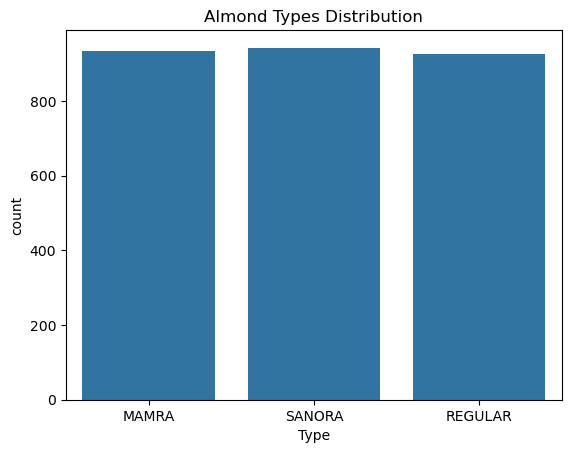
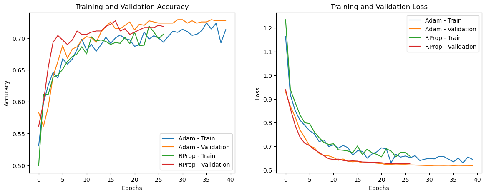
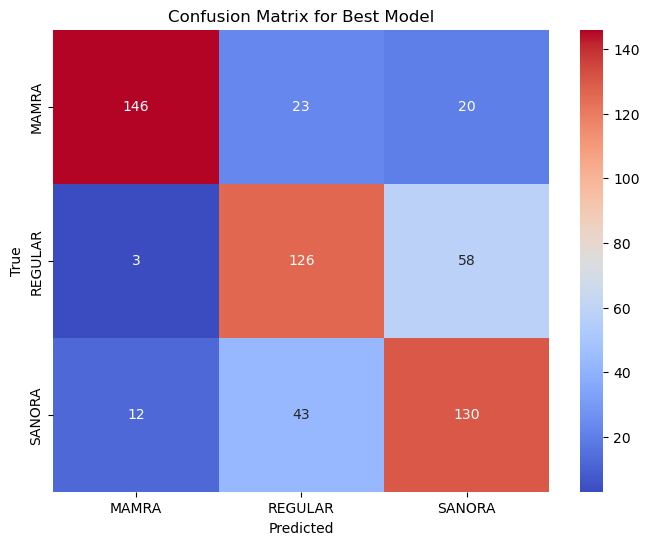

# COS711 Assignment 2
The following code runs the neural network for COS711 Assignment 2


```python
import pandas as pd
```


```python
import numpy as np
```


```python
import matplotlib.pyplot as plt
```


```python
import seaborn as sns
```


```python
from sklearn.model_selection import train_test_split, GridSearchCV
```


```python
from sklearn.preprocessing import StandardScaler, OneHotEncoder
```


```python
from sklearn.impute import SimpleImputer
```


```python
from sklearn.metrics import classification_report, confusion_matrix
```


```python
import tensorflow as tf
```


    ---------------------------------------------------------------------------

    ModuleNotFoundError                       Traceback (most recent call last)

    Cell In[10], line 1
    ----> 1 import tensorflow as tf
    

    ModuleNotFoundError: No module named 'tensorflow'


```python
from sklearn.model_selection import ParameterGrid
```


```python
from tensorflow.keras.models import Sequential, load_model
from tensorflow.keras.layers import Dense, Dropout, BatchNormalization
from tensorflow.keras.optimizers import Adam, RMSprop
from tensorflow.keras.callbacks import EarlyStopping, ModelCheckpoint, ReduceLROnPlateau
```


    ---------------------------------------------------------------------------

    ModuleNotFoundError                       Traceback (most recent call last)

    Cell In[11], line 1
    ----> 1 from tensorflow.keras.models import Sequential, load_model
          2 from tensorflow.keras.layers import Dense, Dropout, BatchNormalization
          3 from tensorflow.keras.optimizers import Adam, RMSprop
    

    ModuleNotFoundError: No module named 'tensorflow'


```python
import tensorflow as tf
```


    ---------------------------------------------------------------------------

    ModuleNotFoundError                       Traceback (most recent call last)

    Cell In[13], line 1
    ----> 1 import tensorflow as tf
    

    ModuleNotFoundError: No module named 'tensorflow'


```python
pip install tensorflow
```

    Collecting tensorflowNote: you may need to restart the kernel to use updated packages.
    
      Downloading tensorflow-2.17.0-cp312-cp312-win_amd64.whl.metadata (3.2 kB)
    Collecting tensorflow-intel==2.17.0 (from tensorflow)
      Downloading tensorflow_intel-2.17.0-cp312-cp312-win_amd64.whl.metadata (5.0 kB)
    Collecting absl-py>=1.0.0 (from tensorflow-intel==2.17.0->tensorflow)
      Downloading absl_py-2.1.0-py3-none-any.whl.metadata (2.3 kB)
    Collecting astunparse>=1.6.0 (from tensorflow-intel==2.17.0->tensorflow)
      Downloading astunparse-1.6.3-py2.py3-none-any.whl.metadata (4.4 kB)
    Collecting flatbuffers>=24.3.25 (from tensorflow-intel==2.17.0->tensorflow)
      Downloading flatbuffers-24.3.25-py2.py3-none-any.whl.metadata (850 bytes)
    Collecting gast!=0.5.0,!=0.5.1,!=0.5.2,>=0.2.1 (from tensorflow-intel==2.17.0->tensorflow)
      Downloading gast-0.6.0-py3-none-any.whl.metadata (1.3 kB)
    Collecting google-pasta>=0.1.1 (from tensorflow-intel==2.17.0->tensorflow)
      Downloading google_pasta-0.2.0-py3-none-any.whl.metadata (814 bytes)
    Requirement already satisfied: h5py>=3.10.0 in c:\users\user\anaconda3\lib\site-packages (from tensorflow-intel==2.17.0->tensorflow) (3.11.0)
    Collecting libclang>=13.0.0 (from tensorflow-intel==2.17.0->tensorflow)
      Downloading libclang-18.1.1-py2.py3-none-win_amd64.whl.metadata (5.3 kB)
    Collecting ml-dtypes<0.5.0,>=0.3.1 (from tensorflow-intel==2.17.0->tensorflow)
      Downloading ml_dtypes-0.4.1-cp312-cp312-win_amd64.whl.metadata (20 kB)
    Collecting opt-einsum>=2.3.2 (from tensorflow-intel==2.17.0->tensorflow)
      Downloading opt_einsum-3.4.0-py3-none-any.whl.metadata (6.3 kB)
    Requirement already satisfied: packaging in c:\users\user\anaconda3\lib\site-packages (from tensorflow-intel==2.17.0->tensorflow) (23.2)
    Requirement already satisfied: protobuf!=4.21.0,!=4.21.1,!=4.21.2,!=4.21.3,!=4.21.4,!=4.21.5,<5.0.0dev,>=3.20.3 in c:\users\user\anaconda3\lib\site-packages (from tensorflow-intel==2.17.0->tensorflow) (3.20.3)
    Requirement already satisfied: requests<3,>=2.21.0 in c:\users\user\anaconda3\lib\site-packages (from tensorflow-intel==2.17.0->tensorflow) (2.32.2)
    Requirement already satisfied: setuptools in c:\users\user\anaconda3\lib\site-packages (from tensorflow-intel==2.17.0->tensorflow) (72.1.0)
    Requirement already satisfied: six>=1.12.0 in c:\users\user\anaconda3\lib\site-packages (from tensorflow-intel==2.17.0->tensorflow) (1.16.0)
    Collecting termcolor>=1.1.0 (from tensorflow-intel==2.17.0->tensorflow)
      Downloading termcolor-2.4.0-py3-none-any.whl.metadata (6.1 kB)
    Requirement already satisfied: typing-extensions>=3.6.6 in c:\users\user\anaconda3\lib\site-packages (from tensorflow-intel==2.17.0->tensorflow) (4.11.0)
    Requirement already satisfied: wrapt>=1.11.0 in c:\users\user\anaconda3\lib\site-packages (from tensorflow-intel==2.17.0->tensorflow) (1.14.1)
    Collecting grpcio<2.0,>=1.24.3 (from tensorflow-intel==2.17.0->tensorflow)
      Downloading grpcio-1.66.2-cp312-cp312-win_amd64.whl.metadata (4.0 kB)
    Collecting tensorboard<2.18,>=2.17 (from tensorflow-intel==2.17.0->tensorflow)
      Downloading tensorboard-2.17.1-py3-none-any.whl.metadata (1.6 kB)
    Collecting keras>=3.2.0 (from tensorflow-intel==2.17.0->tensorflow)
      Downloading keras-3.6.0-py3-none-any.whl.metadata (5.8 kB)
    Requirement already satisfied: numpy<2.0.0,>=1.26.0 in c:\users\user\anaconda3\lib\site-packages (from tensorflow-intel==2.17.0->tensorflow) (1.26.4)
    Requirement already satisfied: wheel<1.0,>=0.23.0 in c:\users\user\anaconda3\lib\site-packages (from astunparse>=1.6.0->tensorflow-intel==2.17.0->tensorflow) (0.44.0)
    Requirement already satisfied: rich in c:\users\user\anaconda3\lib\site-packages (from keras>=3.2.0->tensorflow-intel==2.17.0->tensorflow) (13.3.5)
    Collecting namex (from keras>=3.2.0->tensorflow-intel==2.17.0->tensorflow)
      Downloading namex-0.0.8-py3-none-any.whl.metadata (246 bytes)
    Collecting optree (from keras>=3.2.0->tensorflow-intel==2.17.0->tensorflow)
      Downloading optree-0.13.0-cp312-cp312-win_amd64.whl.metadata (48 kB)
    Requirement already satisfied: charset-normalizer<4,>=2 in c:\users\user\anaconda3\lib\site-packages (from requests<3,>=2.21.0->tensorflow-intel==2.17.0->tensorflow) (2.0.4)
    Requirement already satisfied: idna<4,>=2.5 in c:\users\user\anaconda3\lib\site-packages (from requests<3,>=2.21.0->tensorflow-intel==2.17.0->tensorflow) (3.7)
    Requirement already satisfied: urllib3<3,>=1.21.1 in c:\users\user\anaconda3\lib\site-packages (from requests<3,>=2.21.0->tensorflow-intel==2.17.0->tensorflow) (2.2.2)
    Requirement already satisfied: certifi>=2017.4.17 in c:\users\user\anaconda3\lib\site-packages (from requests<3,>=2.21.0->tensorflow-intel==2.17.0->tensorflow) (2024.8.30)
    Requirement already satisfied: markdown>=2.6.8 in c:\users\user\anaconda3\lib\site-packages (from tensorboard<2.18,>=2.17->tensorflow-intel==2.17.0->tensorflow) (3.4.1)
    Collecting tensorboard-data-server<0.8.0,>=0.7.0 (from tensorboard<2.18,>=2.17->tensorflow-intel==2.17.0->tensorflow)
      Downloading tensorboard_data_server-0.7.2-py3-none-any.whl.metadata (1.1 kB)
    Requirement already satisfied: werkzeug>=1.0.1 in c:\users\user\anaconda3\lib\site-packages (from tensorboard<2.18,>=2.17->tensorflow-intel==2.17.0->tensorflow) (3.0.3)
    Requirement already satisfied: MarkupSafe>=2.1.1 in c:\users\user\anaconda3\lib\site-packages (from werkzeug>=1.0.1->tensorboard<2.18,>=2.17->tensorflow-intel==2.17.0->tensorflow) (2.1.3)
    Requirement already satisfied: markdown-it-py<3.0.0,>=2.2.0 in c:\users\user\anaconda3\lib\site-packages (from rich->keras>=3.2.0->tensorflow-intel==2.17.0->tensorflow) (2.2.0)
    Requirement already satisfied: pygments<3.0.0,>=2.13.0 in c:\users\user\anaconda3\lib\site-packages (from rich->keras>=3.2.0->tensorflow-intel==2.17.0->tensorflow) (2.15.1)
    Requirement already satisfied: mdurl~=0.1 in c:\users\user\anaconda3\lib\site-packages (from markdown-it-py<3.0.0,>=2.2.0->rich->keras>=3.2.0->tensorflow-intel==2.17.0->tensorflow) (0.1.0)
    Downloading tensorflow-2.17.0-cp312-cp312-win_amd64.whl (2.0 kB)
    Downloading tensorflow_intel-2.17.0-cp312-cp312-win_amd64.whl (385.2 MB)
       ---------------------------------------- 0.0/385.2 MB ? eta -:--:--
       ---------------------------------------- 0.5/385.2 MB 5.6 MB/s eta 0:01:09
       ---------------------------------------- 1.0/385.2 MB 2.5 MB/s eta 0:02:33
       ---------------------------------------- 1.6/385.2 MB 2.5 MB/s eta 0:02:32
       ---------------------------------------- 2.4/385.2 MB 2.7 MB/s eta 0:02:20
       ---------------------------------------- 3.1/385.2 MB 3.0 MB/s eta 0:02:09
       ---------------------------------------- 3.7/385.2 MB 3.1 MB/s eta 0:02:03
       ---------------------------------------- 4.2/385.2 MB 2.8 MB/s eta 0:02:18
       ---------------------------------------- 4.7/385.2 MB 2.7 MB/s eta 0:02:19
        --------------------------------------- 5.5/385.2 MB 2.8 MB/s eta 0:02:14
        --------------------------------------- 6.3/385.2 MB 2.9 MB/s eta 0:02:10
        --------------------------------------- 7.1/385.2 MB 3.0 MB/s eta 0:02:06
        --------------------------------------- 7.6/385.2 MB 3.0 MB/s eta 0:02:07
        --------------------------------------- 8.1/385.2 MB 3.0 MB/s eta 0:02:08
        --------------------------------------- 8.1/385.2 MB 3.0 MB/s eta 0:02:08
        --------------------------------------- 8.4/385.2 MB 2.8 MB/s eta 0:02:17
        --------------------------------------- 8.4/385.2 MB 2.8 MB/s eta 0:02:17
        --------------------------------------- 8.4/385.2 MB 2.8 MB/s eta 0:02:17
        --------------------------------------- 8.7/385.2 MB 2.3 MB/s eta 0:02:45
        --------------------------------------- 8.7/385.2 MB 2.3 MB/s eta 0:02:45
        --------------------------------------- 8.7/385.2 MB 2.3 MB/s eta 0:02:45
        --------------------------------------- 8.7/385.2 MB 2.3 MB/s eta 0:02:45
        --------------------------------------- 8.9/385.2 MB 1.9 MB/s eta 0:03:18
        --------------------------------------- 8.9/385.2 MB 1.9 MB/s eta 0:03:18
        --------------------------------------- 8.9/385.2 MB 1.9 MB/s eta 0:03:18
        --------------------------------------- 9.2/385.2 MB 1.7 MB/s eta 0:03:35
        --------------------------------------- 9.2/385.2 MB 1.7 MB/s eta 0:03:35
        --------------------------------------- 9.4/385.2 MB 1.6 MB/s eta 0:03:51
        --------------------------------------- 9.4/385.2 MB 1.6 MB/s eta 0:03:51
       - -------------------------------------- 9.7/385.2 MB 1.6 MB/s eta 0:04:01
       - -------------------------------------- 10.0/385.2 MB 1.5 MB/s eta 0:04:05
       - -------------------------------------- 10.2/385.2 MB 1.5 MB/s eta 0:04:03
       - -------------------------------------- 10.5/385.2 MB 1.5 MB/s eta 0:04:03
       - -------------------------------------- 11.0/385.2 MB 1.6 MB/s eta 0:04:01
       - -------------------------------------- 11.5/385.2 MB 1.6 MB/s eta 0:03:59
       - -------------------------------------- 11.8/385.2 MB 1.6 MB/s eta 0:03:55
       - -------------------------------------- 12.1/385.2 MB 1.6 MB/s eta 0:03:57
       - -------------------------------------- 12.6/385.2 MB 1.6 MB/s eta 0:03:53
       - -------------------------------------- 13.4/385.2 MB 1.6 MB/s eta 0:03:48
       - -------------------------------------- 13.9/385.2 MB 1.7 MB/s eta 0:03:45
       - -------------------------------------- 14.7/385.2 MB 1.7 MB/s eta 0:03:38
       - -------------------------------------- 14.9/385.2 MB 1.7 MB/s eta 0:03:36
       - -------------------------------------- 15.5/385.2 MB 1.7 MB/s eta 0:03:37
       - -------------------------------------- 16.0/385.2 MB 1.7 MB/s eta 0:03:35
       - -------------------------------------- 16.0/385.2 MB 1.7 MB/s eta 0:03:35
       - -------------------------------------- 16.5/385.2 MB 1.7 MB/s eta 0:03:36
       - -------------------------------------- 16.5/385.2 MB 1.7 MB/s eta 0:03:36
       - -------------------------------------- 16.8/385.2 MB 1.7 MB/s eta 0:03:39
       - -------------------------------------- 16.8/385.2 MB 1.7 MB/s eta 0:03:39
       - -------------------------------------- 16.8/385.2 MB 1.7 MB/s eta 0:03:39
       - -------------------------------------- 17.0/385.2 MB 1.6 MB/s eta 0:03:51
       - -------------------------------------- 17.0/385.2 MB 1.6 MB/s eta 0:03:51
       - -------------------------------------- 17.3/385.2 MB 1.6 MB/s eta 0:03:57
       - -------------------------------------- 17.3/385.2 MB 1.6 MB/s eta 0:03:57
       - -------------------------------------- 17.6/385.2 MB 1.5 MB/s eta 0:04:01
       - -------------------------------------- 17.8/385.2 MB 1.5 MB/s eta 0:04:05
       - -------------------------------------- 17.8/385.2 MB 1.5 MB/s eta 0:04:05
       - -------------------------------------- 18.1/385.2 MB 1.5 MB/s eta 0:04:07
       - -------------------------------------- 18.1/385.2 MB 1.5 MB/s eta 0:04:07
       - -------------------------------------- 18.4/385.2 MB 1.4 MB/s eta 0:04:15
       - -------------------------------------- 18.4/385.2 MB 1.4 MB/s eta 0:04:15
       - -------------------------------------- 18.4/385.2 MB 1.4 MB/s eta 0:04:15
       - -------------------------------------- 18.4/385.2 MB 1.4 MB/s eta 0:04:15
       - -------------------------------------- 18.4/385.2 MB 1.4 MB/s eta 0:04:15
       - -------------------------------------- 18.4/385.2 MB 1.4 MB/s eta 0:04:15
       - -------------------------------------- 18.4/385.2 MB 1.4 MB/s eta 0:04:15
       - -------------------------------------- 18.4/385.2 MB 1.4 MB/s eta 0:04:15
       - -------------------------------------- 18.4/385.2 MB 1.4 MB/s eta 0:04:15
       - -------------------------------------- 18.4/385.2 MB 1.4 MB/s eta 0:04:15
       - -------------------------------------- 18.4/385.2 MB 1.4 MB/s eta 0:04:15
       - -------------------------------------- 18.4/385.2 MB 1.4 MB/s eta 0:04:15
       - -------------------------------------- 18.4/385.2 MB 1.4 MB/s eta 0:04:15
       - -------------------------------------- 18.4/385.2 MB 1.4 MB/s eta 0:04:15
       - -------------------------------------- 18.4/385.2 MB 1.4 MB/s eta 0:04:15
       - -------------------------------------- 18.4/385.2 MB 1.4 MB/s eta 0:04:15
       - -------------------------------------- 18.4/385.2 MB 1.4 MB/s eta 0:04:15
       - -------------------------------------- 18.4/385.2 MB 1.4 MB/s eta 0:04:15
       - -------------------------------------- 18.4/385.2 MB 1.4 MB/s eta 0:04:15
       - -------------------------------------- 18.6/385.2 MB 1.1 MB/s eta 0:05:30
       - -------------------------------------- 18.6/385.2 MB 1.1 MB/s eta 0:05:30
       - -------------------------------------- 18.6/385.2 MB 1.1 MB/s eta 0:05:30
       - -------------------------------------- 18.6/385.2 MB 1.1 MB/s eta 0:05:30
       - -------------------------------------- 18.9/385.2 MB 1.1 MB/s eta 0:05:42
       - -------------------------------------- 18.9/385.2 MB 1.1 MB/s eta 0:05:42
       - -------------------------------------- 18.9/385.2 MB 1.1 MB/s eta 0:05:42
       - -------------------------------------- 18.9/385.2 MB 1.1 MB/s eta 0:05:42
       - -------------------------------------- 18.9/385.2 MB 1.1 MB/s eta 0:05:42
       - -------------------------------------- 18.9/385.2 MB 1.1 MB/s eta 0:05:42
       - -------------------------------------- 19.1/385.2 MB 1.0 MB/s eta 0:06:02
       - -------------------------------------- 19.1/385.2 MB 1.0 MB/s eta 0:06:02
       - -------------------------------------- 19.1/385.2 MB 1.0 MB/s eta 0:06:02
       - -------------------------------------- 19.1/385.2 MB 1.0 MB/s eta 0:06:02
       - -------------------------------------- 19.1/385.2 MB 1.0 MB/s eta 0:06:02
       - -------------------------------------- 19.1/385.2 MB 1.0 MB/s eta 0:06:02
       - -------------------------------------- 19.1/385.2 MB 1.0 MB/s eta 0:06:02
       - -------------------------------------- 19.1/385.2 MB 1.0 MB/s eta 0:06:02
       - ------------------------------------- 19.4/385.2 MB 942.1 kB/s eta 0:06:29
       - ------------------------------------- 19.4/385.2 MB 942.1 kB/s eta 0:06:29
       - ------------------------------------- 19.4/385.2 MB 942.1 kB/s eta 0:06:29
       - ------------------------------------- 19.4/385.2 MB 942.1 kB/s eta 0:06:29
       - ------------------------------------- 19.4/385.2 MB 942.1 kB/s eta 0:06:29
       - ------------------------------------- 19.4/385.2 MB 942.1 kB/s eta 0:06:29
       - ------------------------------------- 19.4/385.2 MB 942.1 kB/s eta 0:06:29
       - ------------------------------------- 19.7/385.2 MB 886.8 kB/s eta 0:06:53
       -- ------------------------------------ 19.9/385.2 MB 890.5 kB/s eta 0:06:51
       -- ------------------------------------ 20.2/385.2 MB 894.2 kB/s eta 0:06:49
       -- ------------------------------------ 20.2/385.2 MB 894.2 kB/s eta 0:06:49
       -- ------------------------------------ 20.4/385.2 MB 888.5 kB/s eta 0:06:51
       -- ------------------------------------ 20.7/385.2 MB 892.0 kB/s eta 0:06:49
       -- ------------------------------------ 21.0/385.2 MB 896.1 kB/s eta 0:06:47
       -- ------------------------------------ 21.2/385.2 MB 900.2 kB/s eta 0:06:45
       -- ------------------------------------ 21.5/385.2 MB 898.8 kB/s eta 0:06:45
       -- ------------------------------------ 21.8/385.2 MB 903.3 kB/s eta 0:06:43
       -- ------------------------------------ 22.0/385.2 MB 908.9 kB/s eta 0:06:40
       -- ------------------------------------ 22.3/385.2 MB 912.1 kB/s eta 0:06:38
       -- ------------------------------------ 22.5/385.2 MB 913.0 kB/s eta 0:06:38
       -- ------------------------------------ 22.8/385.2 MB 910.9 kB/s eta 0:06:38
       -- ------------------------------------ 22.8/385.2 MB 910.9 kB/s eta 0:06:38
       -- ------------------------------------ 23.1/385.2 MB 909.4 kB/s eta 0:06:39
       -- ------------------------------------ 23.1/385.2 MB 909.4 kB/s eta 0:06:39
       -- ------------------------------------ 23.1/385.2 MB 909.4 kB/s eta 0:06:39
       -- ------------------------------------ 23.3/385.2 MB 896.4 kB/s eta 0:06:44
       -- ------------------------------------ 23.3/385.2 MB 896.4 kB/s eta 0:06:44
       -- ------------------------------------ 23.3/385.2 MB 896.4 kB/s eta 0:06:44
       -- ------------------------------------ 23.3/385.2 MB 896.4 kB/s eta 0:06:44
       -- ------------------------------------ 23.6/385.2 MB 877.8 kB/s eta 0:06:52
       -- ------------------------------------ 23.6/385.2 MB 877.8 kB/s eta 0:06:52
       -- ------------------------------------ 23.6/385.2 MB 877.8 kB/s eta 0:06:52
       -- ------------------------------------ 23.6/385.2 MB 877.8 kB/s eta 0:06:52
       -- ------------------------------------ 23.9/385.2 MB 857.9 kB/s eta 0:07:02
       -- ------------------------------------ 23.9/385.2 MB 857.9 kB/s eta 0:07:02
       -- ------------------------------------ 23.9/385.2 MB 857.9 kB/s eta 0:07:02
       -- ------------------------------------ 24.1/385.2 MB 846.8 kB/s eta 0:07:07
       -- ------------------------------------ 24.1/385.2 MB 846.8 kB/s eta 0:07:07
       -- ------------------------------------ 24.1/385.2 MB 846.8 kB/s eta 0:07:07
       -- ------------------------------------ 24.1/385.2 MB 846.8 kB/s eta 0:07:07
       -- ------------------------------------ 24.1/385.2 MB 846.8 kB/s eta 0:07:07
       -- ------------------------------------ 24.1/385.2 MB 846.8 kB/s eta 0:07:07
       -- ------------------------------------ 24.1/385.2 MB 846.8 kB/s eta 0:07:07
       -- ------------------------------------ 24.1/385.2 MB 846.8 kB/s eta 0:07:07
       -- ------------------------------------ 24.1/385.2 MB 846.8 kB/s eta 0:07:07
       -- ------------------------------------ 24.1/385.2 MB 846.8 kB/s eta 0:07:07
       -- ------------------------------------ 24.1/385.2 MB 846.8 kB/s eta 0:07:07
       -- ------------------------------------ 24.1/385.2 MB 846.8 kB/s eta 0:07:07
       -- ------------------------------------ 24.1/385.2 MB 846.8 kB/s eta 0:07:07
       -- ------------------------------------ 24.1/385.2 MB 846.8 kB/s eta 0:07:07
       -- ------------------------------------ 24.1/385.2 MB 846.8 kB/s eta 0:07:07
       -- ------------------------------------ 24.4/385.2 MB 684.1 kB/s eta 0:08:48
       -- ------------------------------------ 24.9/385.2 MB 673.2 kB/s eta 0:08:56
       -- ------------------------------------ 25.4/385.2 MB 664.5 kB/s eta 0:09:02
       -- ------------------------------------ 25.7/385.2 MB 646.6 kB/s eta 0:09:16
       -- ------------------------------------ 26.2/385.2 MB 637.9 kB/s eta 0:09:23
       -- ------------------------------------ 26.5/385.2 MB 630.8 kB/s eta 0:09:29
       -- ------------------------------------ 27.5/385.2 MB 642.9 kB/s eta 0:09:17
       -- ------------------------------------ 28.3/385.2 MB 664.5 kB/s eta 0:08:58
       -- ------------------------------------ 28.6/385.2 MB 678.6 kB/s eta 0:08:46
       -- ------------------------------------ 29.6/385.2 MB 706.4 kB/s eta 0:08:24
       --- ----------------------------------- 30.4/385.2 MB 728.7 kB/s eta 0:08:07
       --- ----------------------------------- 30.9/385.2 MB 755.6 kB/s eta 0:07:49
       --- ----------------------------------- 31.5/385.2 MB 767.0 kB/s eta 0:07:42
       --- ----------------------------------- 32.0/385.2 MB 781.2 kB/s eta 0:07:33
       --- ----------------------------------- 32.8/385.2 MB 798.9 kB/s eta 0:07:22
       --- ----------------------------------- 33.3/385.2 MB 817.5 kB/s eta 0:07:11
       --- ----------------------------------- 33.8/385.2 MB 828.7 kB/s eta 0:07:04
       --- ----------------------------------- 34.6/385.2 MB 849.4 kB/s eta 0:06:53
       --- ----------------------------------- 35.1/385.2 MB 868.1 kB/s eta 0:06:44
       --- ----------------------------------- 35.4/385.2 MB 873.3 kB/s eta 0:06:41
       --- ----------------------------------- 35.9/385.2 MB 884.4 kB/s eta 0:06:35
       --- ----------------------------------- 36.4/385.2 MB 895.9 kB/s eta 0:06:30
       --- ----------------------------------- 37.0/385.2 MB 907.1 kB/s eta 0:06:24
       --- ----------------------------------- 37.7/385.2 MB 927.2 kB/s eta 0:06:15
       --- ----------------------------------- 38.3/385.2 MB 935.0 kB/s eta 0:06:12
       --- ----------------------------------- 38.8/385.2 MB 938.4 kB/s eta 0:06:10
       --- ----------------------------------- 39.3/385.2 MB 936.9 kB/s eta 0:06:10
       ---- ---------------------------------- 40.1/385.2 MB 953.5 kB/s eta 0:06:02
       ---- ---------------------------------- 40.6/385.2 MB 956.4 kB/s eta 0:06:01
       ---- ---------------------------------- 41.2/385.2 MB 965.7 kB/s eta 0:05:57
       ---- ---------------------------------- 41.7/385.2 MB 964.7 kB/s eta 0:05:57
       ---- ---------------------------------- 41.9/385.2 MB 961.7 kB/s eta 0:05:57
       ---- ---------------------------------- 42.5/385.2 MB 954.0 kB/s eta 0:06:00
       ---- ---------------------------------- 43.3/385.2 MB 961.2 kB/s eta 0:05:56
       ---- ---------------------------------- 43.8/385.2 MB 957.0 kB/s eta 0:05:57
       ---- ---------------------------------- 44.6/385.2 MB 970.5 kB/s eta 0:05:51
       ---- ---------------------------------- 45.1/385.2 MB 979.2 kB/s eta 0:05:48
       ---- ---------------------------------- 45.6/385.2 MB 983.8 kB/s eta 0:05:46
       ---- ---------------------------------- 45.9/385.2 MB 987.9 kB/s eta 0:05:44
       ---- ---------------------------------- 46.1/385.2 MB 987.4 kB/s eta 0:05:44
       ---- ----------------------------------- 46.4/385.2 MB 1.0 MB/s eta 0:05:39
       ---- ----------------------------------- 46.7/385.2 MB 1.0 MB/s eta 0:05:38
       ---- ----------------------------------- 46.9/385.2 MB 1.0 MB/s eta 0:05:37
       ---- ----------------------------------- 46.9/385.2 MB 1.0 MB/s eta 0:05:37
       ---- ----------------------------------- 47.4/385.2 MB 1.0 MB/s eta 0:05:34
       ---- ----------------------------------- 47.7/385.2 MB 1.0 MB/s eta 0:05:32
       ----- ---------------------------------- 48.2/385.2 MB 1.0 MB/s eta 0:05:29
       ----- ---------------------------------- 48.5/385.2 MB 1.0 MB/s eta 0:05:26
       ----- ---------------------------------- 48.8/385.2 MB 1.0 MB/s eta 0:05:26
       ----- ---------------------------------- 49.3/385.2 MB 1.0 MB/s eta 0:05:21
       ----- ---------------------------------- 50.1/385.2 MB 1.1 MB/s eta 0:05:12
       ----- ---------------------------------- 50.1/385.2 MB 1.1 MB/s eta 0:05:12
       ----- ---------------------------------- 50.6/385.2 MB 1.1 MB/s eta 0:05:10
       ----- ---------------------------------- 51.1/385.2 MB 1.2 MB/s eta 0:04:29
       ----- ---------------------------------- 51.9/385.2 MB 1.3 MB/s eta 0:04:24
       ----- ---------------------------------- 52.4/385.2 MB 1.3 MB/s eta 0:04:21
       ----- ---------------------------------- 53.2/385.2 MB 1.3 MB/s eta 0:04:17
       ----- ---------------------------------- 54.0/385.2 MB 1.3 MB/s eta 0:04:13
       ----- ---------------------------------- 54.3/385.2 MB 1.3 MB/s eta 0:04:12
       ----- ---------------------------------- 55.1/385.2 MB 1.3 MB/s eta 0:04:09
       ----- ---------------------------------- 55.6/385.2 MB 1.3 MB/s eta 0:04:07
       ----- ---------------------------------- 56.6/385.2 MB 1.4 MB/s eta 0:04:01
       ----- ---------------------------------- 57.4/385.2 MB 1.4 MB/s eta 0:03:57
       ------ --------------------------------- 58.2/385.2 MB 1.4 MB/s eta 0:03:54
       ------ --------------------------------- 59.2/385.2 MB 1.4 MB/s eta 0:03:49
       ------ --------------------------------- 60.3/385.2 MB 1.5 MB/s eta 0:03:44
       ------ --------------------------------- 61.3/385.2 MB 1.5 MB/s eta 0:03:40
       ------ --------------------------------- 61.9/385.2 MB 1.5 MB/s eta 0:03:38
       ------ --------------------------------- 62.1/385.2 MB 1.5 MB/s eta 0:03:37
       ------ --------------------------------- 62.7/385.2 MB 1.5 MB/s eta 0:03:37
       ------ --------------------------------- 63.2/385.2 MB 1.5 MB/s eta 0:03:35
       ------ --------------------------------- 63.7/385.2 MB 1.5 MB/s eta 0:03:34
       ------ --------------------------------- 64.7/385.2 MB 1.6 MB/s eta 0:03:26
       ------ --------------------------------- 65.3/385.2 MB 1.6 MB/s eta 0:03:24
       ------ --------------------------------- 65.5/385.2 MB 1.6 MB/s eta 0:03:24
       ------ --------------------------------- 66.3/385.2 MB 1.6 MB/s eta 0:03:14
       ------ --------------------------------- 66.8/385.2 MB 1.6 MB/s eta 0:03:14
       ------ --------------------------------- 67.1/385.2 MB 1.6 MB/s eta 0:03:13
       ------- -------------------------------- 67.6/385.2 MB 1.7 MB/s eta 0:03:12
       ------- -------------------------------- 68.2/385.2 MB 1.7 MB/s eta 0:03:11
       ------- -------------------------------- 68.9/385.2 MB 1.7 MB/s eta 0:03:09
       ------- -------------------------------- 69.7/385.2 MB 1.7 MB/s eta 0:03:07
       ------- -------------------------------- 70.5/385.2 MB 1.8 MB/s eta 0:02:56
       ------- -------------------------------- 71.3/385.2 MB 1.8 MB/s eta 0:02:54
       ------- -------------------------------- 71.6/385.2 MB 1.8 MB/s eta 0:02:54
       ------- -------------------------------- 72.4/385.2 MB 1.8 MB/s eta 0:02:53
       ------- -------------------------------- 72.6/385.2 MB 1.8 MB/s eta 0:02:52
       ------- -------------------------------- 72.9/385.2 MB 1.8 MB/s eta 0:02:52
       ------- -------------------------------- 73.4/385.2 MB 1.8 MB/s eta 0:02:52
       ------- -------------------------------- 73.7/385.2 MB 1.8 MB/s eta 0:02:52
       ------- -------------------------------- 74.2/385.2 MB 1.9 MB/s eta 0:02:44
       ------- -------------------------------- 74.7/385.2 MB 1.9 MB/s eta 0:02:43
       ------- -------------------------------- 75.0/385.2 MB 1.9 MB/s eta 0:02:43
       ------- -------------------------------- 75.5/385.2 MB 1.9 MB/s eta 0:02:43
       ------- -------------------------------- 76.0/385.2 MB 1.9 MB/s eta 0:02:42
       ------- -------------------------------- 76.3/385.2 MB 1.9 MB/s eta 0:02:42
       ------- -------------------------------- 76.8/385.2 MB 1.9 MB/s eta 0:02:42
       -------- ------------------------------- 77.1/385.2 MB 1.9 MB/s eta 0:02:41
       -------- ------------------------------- 77.6/385.2 MB 1.9 MB/s eta 0:02:41
       -------- ------------------------------- 77.9/385.2 MB 1.9 MB/s eta 0:02:39
       -------- ------------------------------- 78.6/385.2 MB 1.9 MB/s eta 0:02:38
       -------- ------------------------------- 79.2/385.2 MB 2.0 MB/s eta 0:02:37
       -------- ------------------------------- 80.0/385.2 MB 2.0 MB/s eta 0:02:36
       -------- ------------------------------- 80.7/385.2 MB 2.0 MB/s eta 0:02:34
       -------- ------------------------------- 81.3/385.2 MB 2.0 MB/s eta 0:02:32
       -------- ------------------------------- 81.5/385.2 MB 2.0 MB/s eta 0:02:32
       -------- ------------------------------- 82.1/385.2 MB 2.0 MB/s eta 0:02:32
       -------- ------------------------------- 82.6/385.2 MB 2.0 MB/s eta 0:02:31
       -------- ------------------------------- 83.1/385.2 MB 2.0 MB/s eta 0:02:30
       -------- ------------------------------- 83.6/385.2 MB 2.0 MB/s eta 0:02:28
       -------- ------------------------------- 83.9/385.2 MB 2.0 MB/s eta 0:02:28
       -------- ------------------------------- 84.7/385.2 MB 2.1 MB/s eta 0:02:26
       -------- ------------------------------- 85.2/385.2 MB 2.1 MB/s eta 0:02:23
       -------- ------------------------------- 86.0/385.2 MB 2.1 MB/s eta 0:02:22
       -------- ------------------------------- 86.2/385.2 MB 2.1 MB/s eta 0:02:22
       --------- ------------------------------ 86.8/385.2 MB 2.2 MB/s eta 0:02:19
       --------- ------------------------------ 87.6/385.2 MB 2.2 MB/s eta 0:02:18
       --------- ------------------------------ 87.8/385.2 MB 2.2 MB/s eta 0:02:18
       --------- ------------------------------ 88.6/385.2 MB 2.2 MB/s eta 0:02:17
       --------- ------------------------------ 89.1/385.2 MB 2.2 MB/s eta 0:02:13
       --------- ------------------------------ 89.7/385.2 MB 2.2 MB/s eta 0:02:13
       --------- ------------------------------ 89.9/385.2 MB 2.2 MB/s eta 0:02:13
       --------- ------------------------------ 90.4/385.2 MB 2.2 MB/s eta 0:02:13
       --------- ------------------------------ 90.4/385.2 MB 2.2 MB/s eta 0:02:13
       --------- ------------------------------ 91.0/385.2 MB 2.3 MB/s eta 0:02:11
       --------- ------------------------------ 91.2/385.2 MB 2.2 MB/s eta 0:02:11
       --------- ------------------------------ 91.5/385.2 MB 2.5 MB/s eta 0:01:59
       --------- ------------------------------ 91.8/385.2 MB 2.5 MB/s eta 0:01:59
       --------- ------------------------------ 92.0/385.2 MB 2.5 MB/s eta 0:01:59
       --------- ------------------------------ 92.3/385.2 MB 2.5 MB/s eta 0:02:00
       --------- ------------------------------ 92.5/385.2 MB 2.5 MB/s eta 0:02:00
       --------- ------------------------------ 92.8/385.2 MB 2.4 MB/s eta 0:02:00
       --------- ------------------------------ 93.1/385.2 MB 2.4 MB/s eta 0:02:01
       --------- ------------------------------ 93.3/385.2 MB 2.4 MB/s eta 0:02:01
       --------- ------------------------------ 93.6/385.2 MB 2.4 MB/s eta 0:02:01
       --------- ------------------------------ 93.8/385.2 MB 2.4 MB/s eta 0:02:01
       --------- ------------------------------ 94.4/385.2 MB 2.4 MB/s eta 0:02:02
       --------- ------------------------------ 94.4/385.2 MB 2.4 MB/s eta 0:02:02
       --------- ------------------------------ 94.9/385.2 MB 2.4 MB/s eta 0:02:02
       --------- ------------------------------ 95.2/385.2 MB 2.4 MB/s eta 0:02:02
       --------- ------------------------------ 95.4/385.2 MB 2.4 MB/s eta 0:02:02
       --------- ------------------------------ 95.7/385.2 MB 2.4 MB/s eta 0:02:02
       --------- ------------------------------ 95.7/385.2 MB 2.4 MB/s eta 0:02:02
       --------- ------------------------------ 95.9/385.2 MB 2.4 MB/s eta 0:02:03
       --------- ------------------------------ 95.9/385.2 MB 2.4 MB/s eta 0:02:03
       --------- ------------------------------ 95.9/385.2 MB 2.4 MB/s eta 0:02:03
       --------- ------------------------------ 95.9/385.2 MB 2.4 MB/s eta 0:02:03
       --------- ------------------------------ 96.2/385.2 MB 2.3 MB/s eta 0:02:06
       ---------- ----------------------------- 96.7/385.2 MB 2.3 MB/s eta 0:02:07
       ---------- ----------------------------- 97.0/385.2 MB 2.3 MB/s eta 0:02:07
       ---------- ----------------------------- 97.5/385.2 MB 2.3 MB/s eta 0:02:08
       ---------- ----------------------------- 98.3/385.2 MB 2.3 MB/s eta 0:02:08
       ---------- ----------------------------- 98.8/385.2 MB 2.3 MB/s eta 0:02:08
       ---------- ----------------------------- 99.1/385.2 MB 2.3 MB/s eta 0:02:07
       ---------- ----------------------------- 99.6/385.2 MB 2.2 MB/s eta 0:02:08
       ---------- ----------------------------- 100.4/385.2 MB 2.3 MB/s eta 0:02:07
       ---------- ----------------------------- 100.7/385.2 MB 2.2 MB/s eta 0:02:08
       ---------- ----------------------------- 100.9/385.2 MB 2.2 MB/s eta 0:02:07
       ---------- ----------------------------- 101.4/385.2 MB 2.2 MB/s eta 0:02:08
       ---------- ----------------------------- 102.0/385.2 MB 2.2 MB/s eta 0:02:08
       ---------- ----------------------------- 102.5/385.2 MB 2.2 MB/s eta 0:02:07
       ---------- ----------------------------- 103.0/385.2 MB 2.2 MB/s eta 0:02:07
       ---------- ----------------------------- 103.3/385.2 MB 2.2 MB/s eta 0:02:07
       ---------- ----------------------------- 103.5/385.2 MB 2.2 MB/s eta 0:02:07
       ---------- ----------------------------- 104.1/385.2 MB 2.2 MB/s eta 0:02:09
       ---------- ----------------------------- 104.3/385.2 MB 2.2 MB/s eta 0:02:09
       ---------- ----------------------------- 104.6/385.2 MB 2.2 MB/s eta 0:02:09
       ---------- ----------------------------- 105.1/385.2 MB 2.2 MB/s eta 0:02:09
       ---------- ----------------------------- 105.4/385.2 MB 2.2 MB/s eta 0:02:09
       ---------- ----------------------------- 105.6/385.2 MB 2.2 MB/s eta 0:02:10
       ---------- ----------------------------- 105.9/385.2 MB 2.2 MB/s eta 0:02:10
       ----------- ---------------------------- 106.2/385.2 MB 2.2 MB/s eta 0:02:10
       ----------- ---------------------------- 106.4/385.2 MB 2.1 MB/s eta 0:02:11
       ----------- ---------------------------- 106.4/385.2 MB 2.1 MB/s eta 0:02:11
       ----------- ---------------------------- 106.7/385.2 MB 2.1 MB/s eta 0:02:12
       ----------- ---------------------------- 107.0/385.2 MB 2.1 MB/s eta 0:02:13
       ----------- ---------------------------- 107.2/385.2 MB 2.1 MB/s eta 0:02:14
       ----------- ---------------------------- 107.5/385.2 MB 2.1 MB/s eta 0:02:14
       ----------- ---------------------------- 107.5/385.2 MB 2.1 MB/s eta 0:02:14
       ----------- ---------------------------- 107.7/385.2 MB 2.1 MB/s eta 0:02:15
       ----------- ---------------------------- 107.7/385.2 MB 2.1 MB/s eta 0:02:15
       ----------- ---------------------------- 108.0/385.2 MB 2.1 MB/s eta 0:02:16
       ----------- ---------------------------- 108.0/385.2 MB 2.1 MB/s eta 0:02:16
       ----------- ---------------------------- 108.0/385.2 MB 2.1 MB/s eta 0:02:16
       ----------- ---------------------------- 108.3/385.2 MB 2.0 MB/s eta 0:02:17
       ----------- ---------------------------- 108.3/385.2 MB 2.0 MB/s eta 0:02:17
       ----------- ---------------------------- 108.3/385.2 MB 2.0 MB/s eta 0:02:17
       ----------- ---------------------------- 108.3/385.2 MB 2.0 MB/s eta 0:02:17
       ----------- ---------------------------- 108.5/385.2 MB 2.0 MB/s eta 0:02:19
       ----------- ---------------------------- 108.5/385.2 MB 2.0 MB/s eta 0:02:19
       ----------- ---------------------------- 108.8/385.2 MB 2.0 MB/s eta 0:02:20
       ----------- ---------------------------- 109.1/385.2 MB 2.0 MB/s eta 0:02:21
       ----------- ---------------------------- 109.1/385.2 MB 2.0 MB/s eta 0:02:21
       ----------- ---------------------------- 109.1/385.2 MB 2.0 MB/s eta 0:02:21
       ----------- ---------------------------- 109.3/385.2 MB 1.9 MB/s eta 0:02:23
       ----------- ---------------------------- 109.6/385.2 MB 1.9 MB/s eta 0:02:24
       ----------- ---------------------------- 109.8/385.2 MB 1.9 MB/s eta 0:02:26
       ----------- ---------------------------- 109.8/385.2 MB 1.9 MB/s eta 0:02:26
       ----------- ---------------------------- 110.1/385.2 MB 1.9 MB/s eta 0:02:28
       ----------- ---------------------------- 110.4/385.2 MB 1.9 MB/s eta 0:02:29
       ----------- ---------------------------- 110.4/385.2 MB 1.9 MB/s eta 0:02:29
       ----------- ---------------------------- 110.4/385.2 MB 1.9 MB/s eta 0:02:29
       ----------- ---------------------------- 110.6/385.2 MB 1.8 MB/s eta 0:02:36
       ----------- ---------------------------- 110.6/385.2 MB 1.8 MB/s eta 0:02:36
       ----------- ---------------------------- 110.6/385.2 MB 1.8 MB/s eta 0:02:36
       ----------- ---------------------------- 110.6/385.2 MB 1.8 MB/s eta 0:02:36
       ----------- ---------------------------- 110.9/385.2 MB 1.7 MB/s eta 0:02:44
       ----------- ---------------------------- 111.1/385.2 MB 1.7 MB/s eta 0:02:46
       ----------- ---------------------------- 111.1/385.2 MB 1.7 MB/s eta 0:02:46
       ----------- ---------------------------- 111.4/385.2 MB 1.6 MB/s eta 0:02:48
       ----------- ---------------------------- 111.7/385.2 MB 1.6 MB/s eta 0:02:49
       ----------- ---------------------------- 111.9/385.2 MB 1.6 MB/s eta 0:02:50
       ----------- ---------------------------- 112.2/385.2 MB 1.6 MB/s eta 0:02:52
       ----------- ---------------------------- 112.5/385.2 MB 1.6 MB/s eta 0:02:53
       ----------- ---------------------------- 112.7/385.2 MB 1.6 MB/s eta 0:02:54
       ----------- ---------------------------- 112.7/385.2 MB 1.6 MB/s eta 0:02:54
       ----------- ---------------------------- 113.0/385.2 MB 1.5 MB/s eta 0:02:57
       ----------- ---------------------------- 113.2/385.2 MB 1.5 MB/s eta 0:02:58
       ----------- ---------------------------- 113.5/385.2 MB 1.5 MB/s eta 0:02:58
       ----------- ---------------------------- 113.8/385.2 MB 1.5 MB/s eta 0:02:59
       ----------- ---------------------------- 114.0/385.2 MB 1.5 MB/s eta 0:03:00
       ----------- ---------------------------- 114.6/385.2 MB 1.5 MB/s eta 0:03:02
       ----------- ---------------------------- 114.8/385.2 MB 1.5 MB/s eta 0:03:04
       ----------- ---------------------------- 115.1/385.2 MB 1.5 MB/s eta 0:03:04
       ------------ --------------------------- 115.6/385.2 MB 1.5 MB/s eta 0:03:05
       ------------ --------------------------- 115.9/385.2 MB 1.5 MB/s eta 0:03:05
       ------------ --------------------------- 116.1/385.2 MB 1.5 MB/s eta 0:03:06
       ------------ --------------------------- 116.7/385.2 MB 1.5 MB/s eta 0:03:05
       ------------ --------------------------- 117.2/385.2 MB 1.5 MB/s eta 0:03:04
       ------------ --------------------------- 117.4/385.2 MB 1.5 MB/s eta 0:03:04
       ------------ --------------------------- 118.0/385.2 MB 1.5 MB/s eta 0:03:04
       ------------ --------------------------- 118.2/385.2 MB 1.5 MB/s eta 0:03:04
       ------------ --------------------------- 118.5/385.2 MB 1.4 MB/s eta 0:03:05
       ------------ --------------------------- 118.8/385.2 MB 1.4 MB/s eta 0:03:05
       ------------ --------------------------- 119.0/385.2 MB 1.4 MB/s eta 0:03:06
       ------------ --------------------------- 119.3/385.2 MB 1.4 MB/s eta 0:03:07
       ------------ --------------------------- 119.3/385.2 MB 1.4 MB/s eta 0:03:07
       ------------ --------------------------- 119.5/385.2 MB 1.4 MB/s eta 0:03:08
       ------------ --------------------------- 119.8/385.2 MB 1.4 MB/s eta 0:03:09
       ------------ --------------------------- 120.3/385.2 MB 1.4 MB/s eta 0:03:08
       ------------ --------------------------- 120.8/385.2 MB 1.4 MB/s eta 0:03:08
       ------------ --------------------------- 121.1/385.2 MB 1.4 MB/s eta 0:03:09
       ------------ --------------------------- 121.4/385.2 MB 1.4 MB/s eta 0:03:12
       ------------ --------------------------- 121.6/385.2 MB 1.4 MB/s eta 0:03:12
       ------------ --------------------------- 122.2/385.2 MB 1.4 MB/s eta 0:03:13
       ------------ --------------------------- 122.7/385.2 MB 1.4 MB/s eta 0:03:13
       ------------ --------------------------- 123.2/385.2 MB 1.4 MB/s eta 0:03:12
       ------------ --------------------------- 123.7/385.2 MB 1.4 MB/s eta 0:03:12
       ------------ --------------------------- 124.0/385.2 MB 1.4 MB/s eta 0:03:12
       ------------ --------------------------- 124.3/385.2 MB 1.4 MB/s eta 0:03:12
       ------------ --------------------------- 124.8/385.2 MB 1.4 MB/s eta 0:03:12
       ------------- -------------------------- 125.3/385.2 MB 1.4 MB/s eta 0:03:12
       ------------- -------------------------- 125.8/385.2 MB 1.3 MB/s eta 0:03:13
       ------------- -------------------------- 126.4/385.2 MB 1.3 MB/s eta 0:03:12
       ------------- -------------------------- 126.9/385.2 MB 1.3 MB/s eta 0:03:12
       ------------- -------------------------- 127.4/385.2 MB 1.3 MB/s eta 0:03:12
       ------------- -------------------------- 127.7/385.2 MB 1.3 MB/s eta 0:03:12
       ------------- -------------------------- 127.9/385.2 MB 1.3 MB/s eta 0:03:13
       ------------- -------------------------- 128.2/385.2 MB 1.3 MB/s eta 0:03:14
       ------------- -------------------------- 128.7/385.2 MB 1.3 MB/s eta 0:03:16
       ------------- -------------------------- 129.5/385.2 MB 1.3 MB/s eta 0:03:13
       ------------- -------------------------- 130.0/385.2 MB 1.3 MB/s eta 0:03:11
       ------------- -------------------------- 130.5/385.2 MB 1.3 MB/s eta 0:03:11
       ------------- -------------------------- 131.1/385.2 MB 1.3 MB/s eta 0:03:09
       ------------- -------------------------- 131.3/385.2 MB 1.3 MB/s eta 0:03:09
       ------------- -------------------------- 131.9/385.2 MB 1.4 MB/s eta 0:03:08
       ------------- -------------------------- 132.4/385.2 MB 1.4 MB/s eta 0:03:06
       ------------- -------------------------- 133.2/385.2 MB 1.4 MB/s eta 0:03:03
       ------------- -------------------------- 133.7/385.2 MB 1.4 MB/s eta 0:03:02
       ------------- -------------------------- 134.0/385.2 MB 1.4 MB/s eta 0:03:02
       ------------- -------------------------- 134.2/385.2 MB 1.4 MB/s eta 0:03:02
       ------------- -------------------------- 134.5/385.2 MB 1.4 MB/s eta 0:03:01
       -------------- ------------------------- 135.0/385.2 MB 1.4 MB/s eta 0:03:01
       -------------- ------------------------- 135.3/385.2 MB 1.4 MB/s eta 0:03:00
       -------------- ------------------------- 135.8/385.2 MB 1.4 MB/s eta 0:02:59
       -------------- ------------------------- 136.1/385.2 MB 1.4 MB/s eta 0:02:59
       -------------- ------------------------- 136.3/385.2 MB 1.4 MB/s eta 0:02:58
       -------------- ------------------------- 136.6/385.2 MB 1.4 MB/s eta 0:02:58
       -------------- ------------------------- 137.1/385.2 MB 1.4 MB/s eta 0:02:58
       -------------- ------------------------- 137.4/385.2 MB 1.4 MB/s eta 0:02:58
       -------------- ------------------------- 137.9/385.2 MB 1.4 MB/s eta 0:02:56
       -------------- ------------------------- 138.4/385.2 MB 1.4 MB/s eta 0:02:54
       -------------- ------------------------- 138.9/385.2 MB 1.5 MB/s eta 0:02:48
       -------------- ------------------------- 139.2/385.2 MB 1.5 MB/s eta 0:02:48
       -------------- ------------------------- 139.7/385.2 MB 1.5 MB/s eta 0:02:47
       -------------- ------------------------- 140.2/385.2 MB 1.5 MB/s eta 0:02:46
       -------------- ------------------------- 140.8/385.2 MB 1.5 MB/s eta 0:02:45
       -------------- ------------------------- 141.0/385.2 MB 1.5 MB/s eta 0:02:45
       -------------- ------------------------- 141.8/385.2 MB 1.5 MB/s eta 0:02:43
       -------------- ------------------------- 142.6/385.2 MB 1.5 MB/s eta 0:02:42
       -------------- ------------------------- 143.1/385.2 MB 1.5 MB/s eta 0:02:42
       -------------- ------------------------- 143.9/385.2 MB 1.5 MB/s eta 0:02:41
       --------------- ------------------------ 144.7/385.2 MB 1.5 MB/s eta 0:02:39
       --------------- ------------------------ 145.2/385.2 MB 1.5 MB/s eta 0:02:38
       --------------- ------------------------ 145.8/385.2 MB 1.5 MB/s eta 0:02:39
       --------------- ------------------------ 146.3/385.2 MB 1.5 MB/s eta 0:02:37
       --------------- ------------------------ 146.8/385.2 MB 1.5 MB/s eta 0:02:37
       --------------- ------------------------ 147.1/385.2 MB 1.5 MB/s eta 0:02:36
       --------------- ------------------------ 147.6/385.2 MB 1.5 MB/s eta 0:02:36
       --------------- ------------------------ 148.1/385.2 MB 1.5 MB/s eta 0:02:36
       --------------- ------------------------ 148.6/385.2 MB 1.5 MB/s eta 0:02:36
       --------------- ------------------------ 149.2/385.2 MB 1.5 MB/s eta 0:02:35
       --------------- ------------------------ 149.7/385.2 MB 1.5 MB/s eta 0:02:34
       --------------- ------------------------ 149.9/385.2 MB 1.5 MB/s eta 0:02:34
       --------------- ------------------------ 150.7/385.2 MB 1.5 MB/s eta 0:02:32
       --------------- ------------------------ 151.0/385.2 MB 1.5 MB/s eta 0:02:32
       --------------- ------------------------ 151.5/385.2 MB 1.6 MB/s eta 0:02:31
       --------------- ------------------------ 152.0/385.2 MB 1.6 MB/s eta 0:02:30
       --------------- ------------------------ 152.3/385.2 MB 1.6 MB/s eta 0:02:30
       --------------- ------------------------ 152.8/385.2 MB 1.6 MB/s eta 0:02:29
       --------------- ------------------------ 153.4/385.2 MB 1.6 MB/s eta 0:02:27
       --------------- ------------------------ 153.9/385.2 MB 1.6 MB/s eta 0:02:26
       ---------------- ----------------------- 154.4/385.2 MB 1.6 MB/s eta 0:02:25
       ---------------- ----------------------- 155.2/385.2 MB 1.6 MB/s eta 0:02:23
       ---------------- ----------------------- 155.7/385.2 MB 1.6 MB/s eta 0:02:22
       ---------------- ----------------------- 156.0/385.2 MB 1.6 MB/s eta 0:02:21
       ---------------- ----------------------- 156.5/385.2 MB 1.6 MB/s eta 0:02:20
       ---------------- ----------------------- 156.8/385.2 MB 1.6 MB/s eta 0:02:20
       ---------------- ----------------------- 157.0/385.2 MB 1.6 MB/s eta 0:02:19
       ---------------- ----------------------- 157.8/385.2 MB 1.7 MB/s eta 0:02:16
       ---------------- ----------------------- 158.3/385.2 MB 1.7 MB/s eta 0:02:16
       ---------------- ----------------------- 158.9/385.2 MB 1.7 MB/s eta 0:02:12
       ---------------- ----------------------- 159.6/385.2 MB 1.7 MB/s eta 0:02:11
       ---------------- ----------------------- 160.4/385.2 MB 1.7 MB/s eta 0:02:09
       ---------------- ----------------------- 161.2/385.2 MB 1.8 MB/s eta 0:02:05
       ---------------- ----------------------- 162.3/385.2 MB 1.8 MB/s eta 0:02:03
       ---------------- ----------------------- 162.8/385.2 MB 1.8 MB/s eta 0:02:02
       ---------------- ----------------------- 162.8/385.2 MB 1.8 MB/s eta 0:02:02
       ----------------- ---------------------- 163.8/385.2 MB 1.8 MB/s eta 0:02:01
       ----------------- ---------------------- 164.4/385.2 MB 1.9 MB/s eta 0:01:59
       ----------------- ---------------------- 164.9/385.2 MB 1.9 MB/s eta 0:01:59
       ----------------- ---------------------- 165.7/385.2 MB 1.9 MB/s eta 0:01:56
       ----------------- ---------------------- 165.9/385.2 MB 1.9 MB/s eta 0:01:56
       ----------------- ---------------------- 166.5/385.2 MB 1.9 MB/s eta 0:01:55
       ----------------- ---------------------- 166.7/385.2 MB 1.9 MB/s eta 0:01:55
       ----------------- ---------------------- 167.2/385.2 MB 1.9 MB/s eta 0:01:54
       ----------------- ---------------------- 167.8/385.2 MB 1.9 MB/s eta 0:01:53
       ----------------- ---------------------- 168.3/385.2 MB 1.9 MB/s eta 0:01:52
       ----------------- ---------------------- 168.8/385.2 MB 1.9 MB/s eta 0:01:51
       ----------------- ---------------------- 169.3/385.2 MB 2.0 MB/s eta 0:01:49
       ----------------- ---------------------- 169.9/385.2 MB 2.0 MB/s eta 0:01:48
       ----------------- ---------------------- 170.7/385.2 MB 2.0 MB/s eta 0:01:47
       ----------------- ---------------------- 171.4/385.2 MB 2.1 MB/s eta 0:01:44
       ----------------- ---------------------- 172.0/385.2 MB 2.1 MB/s eta 0:01:44
       ----------------- ---------------------- 172.8/385.2 MB 2.1 MB/s eta 0:01:43
       ----------------- ---------------------- 173.3/385.2 MB 2.1 MB/s eta 0:01:42
       ------------------ --------------------- 173.8/385.2 MB 2.1 MB/s eta 0:01:42
       ------------------ --------------------- 174.1/385.2 MB 2.1 MB/s eta 0:01:41
       ------------------ --------------------- 174.9/385.2 MB 2.1 MB/s eta 0:01:40
       ------------------ --------------------- 175.6/385.2 MB 2.1 MB/s eta 0:01:39
       ------------------ --------------------- 176.2/385.2 MB 2.1 MB/s eta 0:01:38
       ------------------ --------------------- 176.9/385.2 MB 2.2 MB/s eta 0:01:37
       ------------------ --------------------- 177.5/385.2 MB 2.2 MB/s eta 0:01:36
       ------------------ --------------------- 177.7/385.2 MB 2.2 MB/s eta 0:01:36
       ------------------ --------------------- 178.3/385.2 MB 2.2 MB/s eta 0:01:34
       ------------------ --------------------- 178.8/385.2 MB 2.2 MB/s eta 0:01:34
       ------------------ --------------------- 179.3/385.2 MB 2.2 MB/s eta 0:01:34
       ------------------ --------------------- 180.1/385.2 MB 2.2 MB/s eta 0:01:33
       ------------------ --------------------- 180.4/385.2 MB 2.2 MB/s eta 0:01:32
       ------------------ --------------------- 181.1/385.2 MB 2.2 MB/s eta 0:01:32
       ------------------ --------------------- 181.9/385.2 MB 2.3 MB/s eta 0:01:31
       ------------------- -------------------- 183.0/385.2 MB 2.3 MB/s eta 0:01:29
       ------------------- -------------------- 183.2/385.2 MB 2.3 MB/s eta 0:01:29
       ------------------- -------------------- 183.8/385.2 MB 2.3 MB/s eta 0:01:29
       ------------------- -------------------- 184.5/385.2 MB 2.3 MB/s eta 0:01:28
       ------------------- -------------------- 185.1/385.2 MB 2.3 MB/s eta 0:01:28
       ------------------- -------------------- 185.6/385.2 MB 2.3 MB/s eta 0:01:27
       ------------------- -------------------- 186.4/385.2 MB 2.3 MB/s eta 0:01:26
       ------------------- -------------------- 187.4/385.2 MB 2.3 MB/s eta 0:01:25
       ------------------- -------------------- 188.2/385.2 MB 2.3 MB/s eta 0:01:25
       ------------------- -------------------- 188.7/385.2 MB 2.4 MB/s eta 0:01:24
       ------------------- -------------------- 189.3/385.2 MB 2.4 MB/s eta 0:01:23
       ------------------- -------------------- 190.3/385.2 MB 2.4 MB/s eta 0:01:22
       ------------------- -------------------- 190.8/385.2 MB 2.4 MB/s eta 0:01:21
       ------------------- -------------------- 191.6/385.2 MB 2.4 MB/s eta 0:01:21
       ------------------- -------------------- 192.4/385.2 MB 2.4 MB/s eta 0:01:19
       -------------------- ------------------- 193.5/385.2 MB 2.5 MB/s eta 0:01:18
       -------------------- ------------------- 194.2/385.2 MB 2.5 MB/s eta 0:01:17
       -------------------- ------------------- 194.8/385.2 MB 2.5 MB/s eta 0:01:17
       -------------------- ------------------- 195.6/385.2 MB 2.5 MB/s eta 0:01:17
       -------------------- ------------------- 196.1/385.2 MB 2.5 MB/s eta 0:01:16
       -------------------- ------------------- 197.1/385.2 MB 2.5 MB/s eta 0:01:15
       -------------------- ------------------- 198.2/385.2 MB 2.6 MB/s eta 0:01:14
       -------------------- ------------------- 199.0/385.2 MB 2.6 MB/s eta 0:01:13
       -------------------- ------------------- 200.0/385.2 MB 2.6 MB/s eta 0:01:12
       -------------------- ------------------- 201.1/385.2 MB 2.6 MB/s eta 0:01:11
       -------------------- ------------------- 202.1/385.2 MB 2.6 MB/s eta 0:01:10
       --------------------- ------------------ 202.9/385.2 MB 2.6 MB/s eta 0:01:10
       --------------------- ------------------ 203.4/385.2 MB 2.6 MB/s eta 0:01:09
       --------------------- ------------------ 204.2/385.2 MB 2.7 MB/s eta 0:01:09
       --------------------- ------------------ 205.3/385.2 MB 2.7 MB/s eta 0:01:08
       --------------------- ------------------ 206.3/385.2 MB 2.7 MB/s eta 0:01:07
       --------------------- ------------------ 206.8/385.2 MB 2.7 MB/s eta 0:01:07
       --------------------- ------------------ 207.6/385.2 MB 2.7 MB/s eta 0:01:07
       --------------------- ------------------ 208.4/385.2 MB 2.7 MB/s eta 0:01:06
       --------------------- ------------------ 208.7/385.2 MB 2.7 MB/s eta 0:01:06
       --------------------- ------------------ 208.7/385.2 MB 2.7 MB/s eta 0:01:06
       --------------------- ------------------ 208.7/385.2 MB 2.7 MB/s eta 0:01:06
       --------------------- ------------------ 209.7/385.2 MB 2.7 MB/s eta 0:01:05
       --------------------- ------------------ 210.5/385.2 MB 2.7 MB/s eta 0:01:05
       --------------------- ------------------ 211.0/385.2 MB 2.7 MB/s eta 0:01:05
       --------------------- ------------------ 211.8/385.2 MB 2.7 MB/s eta 0:01:04
       ---------------------- ----------------- 212.6/385.2 MB 2.7 MB/s eta 0:01:04
       ---------------------- ----------------- 213.6/385.2 MB 2.7 MB/s eta 0:01:03
       ---------------------- ----------------- 214.4/385.2 MB 2.8 MB/s eta 0:01:03
       ---------------------- ----------------- 215.2/385.2 MB 2.8 MB/s eta 0:01:02
       ---------------------- ----------------- 216.0/385.2 MB 2.8 MB/s eta 0:01:02
       ---------------------- ----------------- 216.8/385.2 MB 2.8 MB/s eta 0:01:01
       ---------------------- ----------------- 217.6/385.2 MB 2.8 MB/s eta 0:01:00
       ---------------------- ----------------- 218.1/385.2 MB 2.8 MB/s eta 0:01:00
       ---------------------- ----------------- 218.9/385.2 MB 2.8 MB/s eta 0:00:59
       ---------------------- ----------------- 219.7/385.2 MB 2.8 MB/s eta 0:00:59
       ---------------------- ----------------- 220.5/385.2 MB 2.8 MB/s eta 0:00:58
       ---------------------- ----------------- 221.0/385.2 MB 2.9 MB/s eta 0:00:58
       ----------------------- ---------------- 221.5/385.2 MB 2.9 MB/s eta 0:00:58
       ----------------------- ---------------- 222.0/385.2 MB 2.9 MB/s eta 0:00:57
       ----------------------- ---------------- 222.6/385.2 MB 2.9 MB/s eta 0:00:57
       ----------------------- ---------------- 223.1/385.2 MB 2.9 MB/s eta 0:00:57
       ----------------------- ---------------- 223.9/385.2 MB 2.9 MB/s eta 0:00:56
       ----------------------- ---------------- 224.7/385.2 MB 2.9 MB/s eta 0:00:56
       ----------------------- ---------------- 225.2/385.2 MB 2.9 MB/s eta 0:00:56
       ----------------------- ---------------- 226.0/385.2 MB 2.9 MB/s eta 0:00:55
       ----------------------- ---------------- 227.0/385.2 MB 2.9 MB/s eta 0:00:54
       ----------------------- ---------------- 227.8/385.2 MB 2.9 MB/s eta 0:00:54
       ----------------------- ---------------- 228.3/385.2 MB 3.0 MB/s eta 0:00:54
       ----------------------- ---------------- 229.4/385.2 MB 3.0 MB/s eta 0:00:53
       ----------------------- ---------------- 230.7/385.2 MB 3.0 MB/s eta 0:00:52
       ------------------------ --------------- 231.7/385.2 MB 3.0 MB/s eta 0:00:51
       ------------------------ --------------- 233.3/385.2 MB 3.0 MB/s eta 0:00:50
       ------------------------ --------------- 234.9/385.2 MB 3.1 MB/s eta 0:00:49
       ------------------------ --------------- 235.7/385.2 MB 3.1 MB/s eta 0:00:49
       ------------------------ --------------- 237.0/385.2 MB 3.1 MB/s eta 0:00:48
       ------------------------ --------------- 237.8/385.2 MB 3.1 MB/s eta 0:00:48
       ------------------------ --------------- 238.3/385.2 MB 3.1 MB/s eta 0:00:48
       ------------------------ --------------- 239.3/385.2 MB 3.1 MB/s eta 0:00:47
       ------------------------ --------------- 240.1/385.2 MB 3.1 MB/s eta 0:00:47
       ------------------------- -------------- 241.4/385.2 MB 3.1 MB/s eta 0:00:46
       ------------------------- -------------- 242.5/385.2 MB 3.2 MB/s eta 0:00:45
       ------------------------- -------------- 243.8/385.2 MB 3.2 MB/s eta 0:00:45
       ------------------------- -------------- 245.1/385.2 MB 3.2 MB/s eta 0:00:44
       ------------------------- -------------- 245.9/385.2 MB 3.2 MB/s eta 0:00:43
       ------------------------- -------------- 246.9/385.2 MB 3.3 MB/s eta 0:00:43
       ------------------------- -------------- 248.3/385.2 MB 3.3 MB/s eta 0:00:42
       ------------------------- -------------- 248.8/385.2 MB 3.3 MB/s eta 0:00:42
       ------------------------- -------------- 249.3/385.2 MB 3.3 MB/s eta 0:00:42
       ------------------------- -------------- 250.1/385.2 MB 3.3 MB/s eta 0:00:41
       -------------------------- ------------- 250.9/385.2 MB 3.3 MB/s eta 0:00:41
       -------------------------- ------------- 251.4/385.2 MB 3.3 MB/s eta 0:00:41
       -------------------------- ------------- 252.4/385.2 MB 3.3 MB/s eta 0:00:40
       -------------------------- ------------- 253.0/385.2 MB 3.3 MB/s eta 0:00:40
       -------------------------- ------------- 253.8/385.2 MB 3.3 MB/s eta 0:00:40
       -------------------------- ------------- 254.3/385.2 MB 3.4 MB/s eta 0:00:40
       -------------------------- ------------- 255.1/385.2 MB 3.4 MB/s eta 0:00:39
       -------------------------- ------------- 255.6/385.2 MB 3.4 MB/s eta 0:00:39
       -------------------------- ------------- 256.6/385.2 MB 3.4 MB/s eta 0:00:39
       -------------------------- ------------- 257.2/385.2 MB 3.4 MB/s eta 0:00:38
       -------------------------- ------------- 257.9/385.2 MB 3.4 MB/s eta 0:00:38
       -------------------------- ------------- 258.2/385.2 MB 3.4 MB/s eta 0:00:38
       -------------------------- ------------- 259.0/385.2 MB 3.4 MB/s eta 0:00:38
       -------------------------- ------------- 259.5/385.2 MB 3.4 MB/s eta 0:00:37
       --------------------------- ------------ 260.0/385.2 MB 3.4 MB/s eta 0:00:37
       --------------------------- ------------ 260.0/385.2 MB 3.4 MB/s eta 0:00:37
       --------------------------- ------------ 260.6/385.2 MB 3.4 MB/s eta 0:00:37
       --------------------------- ------------ 261.1/385.2 MB 3.4 MB/s eta 0:00:37
       --------------------------- ------------ 261.6/385.2 MB 3.4 MB/s eta 0:00:37
       --------------------------- ------------ 262.1/385.2 MB 3.3 MB/s eta 0:00:37
       --------------------------- ------------ 262.7/385.2 MB 3.3 MB/s eta 0:00:37
       --------------------------- ------------ 263.5/385.2 MB 3.4 MB/s eta 0:00:37
       --------------------------- ------------ 264.0/385.2 MB 3.3 MB/s eta 0:00:37
       --------------------------- ------------ 264.5/385.2 MB 3.4 MB/s eta 0:00:37
       --------------------------- ------------ 265.3/385.2 MB 3.4 MB/s eta 0:00:36
       --------------------------- ------------ 266.1/385.2 MB 3.3 MB/s eta 0:00:36
       --------------------------- ------------ 266.9/385.2 MB 3.4 MB/s eta 0:00:36
       --------------------------- ------------ 267.9/385.2 MB 3.4 MB/s eta 0:00:35
       --------------------------- ------------ 269.5/385.2 MB 3.4 MB/s eta 0:00:34
       ---------------------------- ----------- 270.3/385.2 MB 3.4 MB/s eta 0:00:34
       ---------------------------- ----------- 271.3/385.2 MB 3.5 MB/s eta 0:00:33
       ---------------------------- ----------- 272.6/385.2 MB 3.5 MB/s eta 0:00:33
       ---------------------------- ----------- 273.9/385.2 MB 3.5 MB/s eta 0:00:32
       ---------------------------- ----------- 274.5/385.2 MB 3.5 MB/s eta 0:00:32
       ---------------------------- ----------- 275.3/385.2 MB 3.5 MB/s eta 0:00:32
       ---------------------------- ----------- 276.3/385.2 MB 3.5 MB/s eta 0:00:31
       ---------------------------- ----------- 277.1/385.2 MB 3.5 MB/s eta 0:00:31
       ---------------------------- ----------- 277.9/385.2 MB 3.5 MB/s eta 0:00:31
       ---------------------------- ----------- 278.7/385.2 MB 3.5 MB/s eta 0:00:31
       ----------------------------- ---------- 279.7/385.2 MB 3.5 MB/s eta 0:00:30
       ----------------------------- ---------- 280.5/385.2 MB 3.6 MB/s eta 0:00:30
       ----------------------------- ---------- 281.0/385.2 MB 3.6 MB/s eta 0:00:30
       ----------------------------- ---------- 281.3/385.2 MB 3.6 MB/s eta 0:00:30
       ----------------------------- ---------- 282.1/385.2 MB 3.5 MB/s eta 0:00:30
       ----------------------------- ---------- 282.9/385.2 MB 3.5 MB/s eta 0:00:29
       ----------------------------- ---------- 283.1/385.2 MB 3.5 MB/s eta 0:00:29
       ----------------------------- ---------- 283.6/385.2 MB 3.5 MB/s eta 0:00:29
       ----------------------------- ---------- 284.4/385.2 MB 3.6 MB/s eta 0:00:29
       ----------------------------- ---------- 284.7/385.2 MB 3.5 MB/s eta 0:00:29
       ----------------------------- ---------- 285.2/385.2 MB 3.6 MB/s eta 0:00:29
       ----------------------------- ---------- 286.0/385.2 MB 3.6 MB/s eta 0:00:28
       ----------------------------- ---------- 287.0/385.2 MB 3.6 MB/s eta 0:00:28
       ----------------------------- ---------- 287.6/385.2 MB 3.6 MB/s eta 0:00:28
       ----------------------------- ---------- 288.1/385.2 MB 3.6 MB/s eta 0:00:28
       ----------------------------- ---------- 288.6/385.2 MB 3.5 MB/s eta 0:00:28
       ------------------------------ --------- 289.7/385.2 MB 3.6 MB/s eta 0:00:27
       ------------------------------ --------- 290.5/385.2 MB 3.6 MB/s eta 0:00:27
       ------------------------------ --------- 291.5/385.2 MB 3.6 MB/s eta 0:00:27
       ------------------------------ --------- 292.6/385.2 MB 3.6 MB/s eta 0:00:26
       ------------------------------ --------- 293.6/385.2 MB 3.6 MB/s eta 0:00:26
       ------------------------------ --------- 294.6/385.2 MB 3.6 MB/s eta 0:00:25
       ------------------------------ --------- 295.7/385.2 MB 3.6 MB/s eta 0:00:25
       ------------------------------ --------- 297.0/385.2 MB 3.6 MB/s eta 0:00:25
       ------------------------------ --------- 298.1/385.2 MB 3.7 MB/s eta 0:00:24
       ------------------------------- -------- 298.8/385.2 MB 3.7 MB/s eta 0:00:24
       ------------------------------- -------- 299.6/385.2 MB 3.7 MB/s eta 0:00:24
       ------------------------------- -------- 300.7/385.2 MB 3.7 MB/s eta 0:00:23
       ------------------------------- -------- 301.7/385.2 MB 3.7 MB/s eta 0:00:23
       ------------------------------- -------- 302.3/385.2 MB 3.7 MB/s eta 0:00:23
       ------------------------------- -------- 303.3/385.2 MB 3.7 MB/s eta 0:00:23
       ------------------------------- -------- 304.1/385.2 MB 3.7 MB/s eta 0:00:22
       ------------------------------- -------- 304.9/385.2 MB 3.7 MB/s eta 0:00:22
       ------------------------------- -------- 305.7/385.2 MB 3.7 MB/s eta 0:00:22
       ------------------------------- -------- 306.4/385.2 MB 3.7 MB/s eta 0:00:22
       ------------------------------- -------- 307.5/385.2 MB 3.7 MB/s eta 0:00:21
       -------------------------------- ------- 308.3/385.2 MB 3.7 MB/s eta 0:00:21
       -------------------------------- ------- 309.1/385.2 MB 3.7 MB/s eta 0:00:21
       -------------------------------- ------- 310.1/385.2 MB 3.7 MB/s eta 0:00:21
       -------------------------------- ------- 310.6/385.2 MB 3.7 MB/s eta 0:00:21
       -------------------------------- ------- 311.2/385.2 MB 3.7 MB/s eta 0:00:21
       -------------------------------- ------- 312.0/385.2 MB 3.7 MB/s eta 0:00:20
       -------------------------------- ------- 313.0/385.2 MB 3.7 MB/s eta 0:00:20
       -------------------------------- ------- 313.8/385.2 MB 3.7 MB/s eta 0:00:20
       -------------------------------- ------- 314.3/385.2 MB 3.7 MB/s eta 0:00:20
       -------------------------------- ------- 314.8/385.2 MB 3.7 MB/s eta 0:00:20
       -------------------------------- ------- 315.9/385.2 MB 3.7 MB/s eta 0:00:19
       -------------------------------- ------- 316.7/385.2 MB 3.7 MB/s eta 0:00:19
       -------------------------------- ------- 317.5/385.2 MB 3.7 MB/s eta 0:00:19
       --------------------------------- ------ 318.2/385.2 MB 3.7 MB/s eta 0:00:19
       --------------------------------- ------ 319.3/385.2 MB 3.7 MB/s eta 0:00:18
       --------------------------------- ------ 320.1/385.2 MB 3.7 MB/s eta 0:00:18
       --------------------------------- ------ 320.9/385.2 MB 3.7 MB/s eta 0:00:18
       --------------------------------- ------ 321.9/385.2 MB 3.7 MB/s eta 0:00:17
       --------------------------------- ------ 322.7/385.2 MB 3.8 MB/s eta 0:00:17
       --------------------------------- ------ 324.0/385.2 MB 3.8 MB/s eta 0:00:17
       --------------------------------- ------ 324.8/385.2 MB 3.8 MB/s eta 0:00:17
       --------------------------------- ------ 325.6/385.2 MB 3.8 MB/s eta 0:00:16
       --------------------------------- ------ 326.6/385.2 MB 3.8 MB/s eta 0:00:16
       --------------------------------- ------ 327.2/385.2 MB 3.8 MB/s eta 0:00:16
       ---------------------------------- ----- 327.9/385.2 MB 3.8 MB/s eta 0:00:16
       ---------------------------------- ----- 329.0/385.2 MB 3.8 MB/s eta 0:00:15
       ---------------------------------- ----- 329.8/385.2 MB 3.8 MB/s eta 0:00:15
       ---------------------------------- ----- 330.8/385.2 MB 3.8 MB/s eta 0:00:15
       ---------------------------------- ----- 331.6/385.2 MB 3.8 MB/s eta 0:00:15
       ---------------------------------- ----- 332.4/385.2 MB 3.8 MB/s eta 0:00:14
       ---------------------------------- ----- 332.4/385.2 MB 3.8 MB/s eta 0:00:14
       ---------------------------------- ----- 332.7/385.2 MB 3.7 MB/s eta 0:00:15
       ---------------------------------- ----- 333.2/385.2 MB 3.7 MB/s eta 0:00:14
       ---------------------------------- ----- 333.7/385.2 MB 3.7 MB/s eta 0:00:14
       ---------------------------------- ----- 334.2/385.2 MB 3.7 MB/s eta 0:00:14
       ---------------------------------- ----- 335.3/385.2 MB 3.8 MB/s eta 0:00:14
       ---------------------------------- ----- 336.1/385.2 MB 3.8 MB/s eta 0:00:14
       ---------------------------------- ----- 336.6/385.2 MB 3.8 MB/s eta 0:00:13
       ---------------------------------- ----- 336.9/385.2 MB 3.8 MB/s eta 0:00:13
       ----------------------------------- ---- 337.4/385.2 MB 3.7 MB/s eta 0:00:13
       ----------------------------------- ---- 337.6/385.2 MB 3.7 MB/s eta 0:00:13
       ----------------------------------- ---- 337.9/385.2 MB 3.7 MB/s eta 0:00:13
       ----------------------------------- ---- 338.4/385.2 MB 3.7 MB/s eta 0:00:13
       ----------------------------------- ---- 339.2/385.2 MB 3.7 MB/s eta 0:00:13
       ----------------------------------- ---- 339.7/385.2 MB 3.7 MB/s eta 0:00:13
       ----------------------------------- ---- 340.3/385.2 MB 3.7 MB/s eta 0:00:13
       ----------------------------------- ---- 340.8/385.2 MB 3.6 MB/s eta 0:00:13
       ----------------------------------- ---- 341.0/385.2 MB 3.6 MB/s eta 0:00:13
       ----------------------------------- ---- 341.6/385.2 MB 3.6 MB/s eta 0:00:13
       ----------------------------------- ---- 342.1/385.2 MB 3.6 MB/s eta 0:00:13
       ----------------------------------- ---- 342.4/385.2 MB 3.5 MB/s eta 0:00:13
       ----------------------------------- ---- 342.9/385.2 MB 3.5 MB/s eta 0:00:12
       ----------------------------------- ---- 343.7/385.2 MB 3.5 MB/s eta 0:00:12
       ----------------------------------- ---- 343.9/385.2 MB 3.5 MB/s eta 0:00:12
       ----------------------------------- ---- 344.5/385.2 MB 3.5 MB/s eta 0:00:12
       ----------------------------------- ---- 345.0/385.2 MB 3.5 MB/s eta 0:00:12
       ----------------------------------- ---- 345.2/385.2 MB 3.5 MB/s eta 0:00:12
       ----------------------------------- ---- 345.5/385.2 MB 3.4 MB/s eta 0:00:12
       ----------------------------------- ---- 345.8/385.2 MB 3.4 MB/s eta 0:00:12
       ----------------------------------- ---- 346.3/385.2 MB 3.4 MB/s eta 0:00:12
       ----------------------------------- ---- 346.6/385.2 MB 3.4 MB/s eta 0:00:12
       ------------------------------------ --- 347.1/385.2 MB 3.3 MB/s eta 0:00:12
       ------------------------------------ --- 347.3/385.2 MB 3.3 MB/s eta 0:00:12
       ------------------------------------ --- 347.9/385.2 MB 3.3 MB/s eta 0:00:12
       ------------------------------------ --- 348.1/385.2 MB 3.3 MB/s eta 0:00:12
       ------------------------------------ --- 348.4/385.2 MB 3.3 MB/s eta 0:00:12
       ------------------------------------ --- 348.7/385.2 MB 3.2 MB/s eta 0:00:12
       ------------------------------------ --- 348.7/385.2 MB 3.2 MB/s eta 0:00:12
       ------------------------------------ --- 349.2/385.2 MB 3.2 MB/s eta 0:00:12
       ------------------------------------ --- 349.4/385.2 MB 3.2 MB/s eta 0:00:12
       ------------------------------------ --- 349.7/385.2 MB 3.2 MB/s eta 0:00:12
       ------------------------------------ --- 350.0/385.2 MB 3.2 MB/s eta 0:00:12
       ------------------------------------ --- 350.0/385.2 MB 3.2 MB/s eta 0:00:12
       ------------------------------------ --- 350.0/385.2 MB 3.2 MB/s eta 0:00:12
       ------------------------------------ --- 350.5/385.2 MB 3.1 MB/s eta 0:00:12
       ------------------------------------ --- 350.7/385.2 MB 3.1 MB/s eta 0:00:12
       ------------------------------------ --- 351.0/385.2 MB 3.1 MB/s eta 0:00:12
       ------------------------------------ --- 351.5/385.2 MB 3.1 MB/s eta 0:00:11
       ------------------------------------ --- 351.8/385.2 MB 3.1 MB/s eta 0:00:11
       ------------------------------------ --- 352.1/385.2 MB 3.1 MB/s eta 0:00:11
       ------------------------------------ --- 352.6/385.2 MB 3.1 MB/s eta 0:00:11
       ------------------------------------ --- 352.8/385.2 MB 3.1 MB/s eta 0:00:11
       ------------------------------------ --- 353.4/385.2 MB 3.1 MB/s eta 0:00:11
       ------------------------------------ --- 353.6/385.2 MB 3.1 MB/s eta 0:00:11
       ------------------------------------ --- 354.2/385.2 MB 3.1 MB/s eta 0:00:11
       ------------------------------------ --- 354.4/385.2 MB 3.1 MB/s eta 0:00:11
       ------------------------------------ --- 354.9/385.2 MB 3.1 MB/s eta 0:00:10
       ------------------------------------ --- 355.5/385.2 MB 3.1 MB/s eta 0:00:10
       ------------------------------------ --- 356.0/385.2 MB 3.0 MB/s eta 0:00:10
       ------------------------------------- -- 356.5/385.2 MB 3.0 MB/s eta 0:00:10
       ------------------------------------- -- 357.0/385.2 MB 3.0 MB/s eta 0:00:10
       ------------------------------------- -- 357.3/385.2 MB 3.0 MB/s eta 0:00:10
       ------------------------------------- -- 357.6/385.2 MB 3.0 MB/s eta 0:00:10
       ------------------------------------- -- 357.6/385.2 MB 3.0 MB/s eta 0:00:10
       ------------------------------------- -- 357.8/385.2 MB 2.9 MB/s eta 0:00:10
       ------------------------------------- -- 358.1/385.2 MB 2.9 MB/s eta 0:00:10
       ------------------------------------- -- 358.4/385.2 MB 2.9 MB/s eta 0:00:10
       ------------------------------------- -- 358.6/385.2 MB 2.8 MB/s eta 0:00:10
       ------------------------------------- -- 358.9/385.2 MB 2.8 MB/s eta 0:00:10
       ------------------------------------- -- 359.4/385.2 MB 2.8 MB/s eta 0:00:10
       ------------------------------------- -- 359.9/385.2 MB 2.8 MB/s eta 0:00:10
       ------------------------------------- -- 360.4/385.2 MB 2.8 MB/s eta 0:00:09
       ------------------------------------- -- 361.2/385.2 MB 2.8 MB/s eta 0:00:09
       ------------------------------------- -- 362.0/385.2 MB 2.8 MB/s eta 0:00:09
       ------------------------------------- -- 362.5/385.2 MB 2.8 MB/s eta 0:00:09
       ------------------------------------- -- 363.6/385.2 MB 2.8 MB/s eta 0:00:08
       ------------------------------------- -- 364.4/385.2 MB 2.8 MB/s eta 0:00:08
       ------------------------------------- -- 364.9/385.2 MB 2.8 MB/s eta 0:00:08
       ------------------------------------- -- 365.4/385.2 MB 2.8 MB/s eta 0:00:08
       -------------------------------------- - 366.0/385.2 MB 2.8 MB/s eta 0:00:07
       -------------------------------------- - 366.7/385.2 MB 2.8 MB/s eta 0:00:07
       -------------------------------------- - 367.3/385.2 MB 2.8 MB/s eta 0:00:07
       -------------------------------------- - 367.5/385.2 MB 2.8 MB/s eta 0:00:07
       -------------------------------------- - 367.8/385.2 MB 2.8 MB/s eta 0:00:07
       -------------------------------------- - 368.3/385.2 MB 2.8 MB/s eta 0:00:07
       -------------------------------------- - 368.8/385.2 MB 2.8 MB/s eta 0:00:06
       -------------------------------------- - 369.1/385.2 MB 2.7 MB/s eta 0:00:06
       -------------------------------------- - 369.6/385.2 MB 2.7 MB/s eta 0:00:06
       -------------------------------------- - 370.4/385.2 MB 2.7 MB/s eta 0:00:06
       -------------------------------------- - 370.9/385.2 MB 2.7 MB/s eta 0:00:06
       -------------------------------------- - 371.5/385.2 MB 2.7 MB/s eta 0:00:05
       -------------------------------------- - 372.2/385.2 MB 2.7 MB/s eta 0:00:05
       -------------------------------------- - 372.8/385.2 MB 2.7 MB/s eta 0:00:05
       -------------------------------------- - 373.6/385.2 MB 2.7 MB/s eta 0:00:05
       -------------------------------------- - 374.3/385.2 MB 2.7 MB/s eta 0:00:05
       -------------------------------------- - 374.6/385.2 MB 2.7 MB/s eta 0:00:04
       -------------------------------------- - 375.1/385.2 MB 2.6 MB/s eta 0:00:04
       -------------------------------------- - 375.4/385.2 MB 2.6 MB/s eta 0:00:04
       ---------------------------------------  376.2/385.2 MB 2.6 MB/s eta 0:00:04
       ---------------------------------------  376.7/385.2 MB 2.6 MB/s eta 0:00:04
       ---------------------------------------  377.0/385.2 MB 2.6 MB/s eta 0:00:04
       ---------------------------------------  377.7/385.2 MB 2.6 MB/s eta 0:00:03
       ---------------------------------------  378.5/385.2 MB 2.6 MB/s eta 0:00:03
       ---------------------------------------  379.3/385.2 MB 2.6 MB/s eta 0:00:03
       ---------------------------------------  380.4/385.2 MB 2.6 MB/s eta 0:00:02
       ---------------------------------------  381.2/385.2 MB 2.6 MB/s eta 0:00:02
       ---------------------------------------  381.9/385.2 MB 2.6 MB/s eta 0:00:02
       ---------------------------------------  382.5/385.2 MB 2.6 MB/s eta 0:00:02
       ---------------------------------------  383.3/385.2 MB 2.6 MB/s eta 0:00:01
       ---------------------------------------  383.8/385.2 MB 2.5 MB/s eta 0:00:01
       ---------------------------------------  384.6/385.2 MB 2.5 MB/s eta 0:00:01
       ---------------------------------------  385.1/385.2 MB 2.5 MB/s eta 0:00:01
       ---------------------------------------  385.1/385.2 MB 2.5 MB/s eta 0:00:01
       ---------------------------------------  385.1/385.2 MB 2.5 MB/s eta 0:00:01
       ---------------------------------------  385.1/385.2 MB 2.5 MB/s eta 0:00:01
       ---------------------------------------  385.1/385.2 MB 2.5 MB/s eta 0:00:01
       ---------------------------------------  385.1/385.2 MB 2.5 MB/s eta 0:00:01
       ---------------------------------------  385.1/385.2 MB 2.5 MB/s eta 0:00:01
       ---------------------------------------- 385.2/385.2 MB 2.4 MB/s eta 0:00:00
    Downloading absl_py-2.1.0-py3-none-any.whl (133 kB)
    Downloading astunparse-1.6.3-py2.py3-none-any.whl (12 kB)
    Downloading flatbuffers-24.3.25-py2.py3-none-any.whl (26 kB)
    Downloading gast-0.6.0-py3-none-any.whl (21 kB)
    Downloading google_pasta-0.2.0-py3-none-any.whl (57 kB)
    Downloading grpcio-1.66.2-cp312-cp312-win_amd64.whl (4.3 MB)
       ---------------------------------------- 0.0/4.3 MB ? eta -:--:--
       ---- ----------------------------------- 0.5/4.3 MB 1.9 MB/s eta 0:00:03
       ------------ --------------------------- 1.3/4.3 MB 3.1 MB/s eta 0:00:01
       ---------------------- ----------------- 2.4/4.3 MB 3.6 MB/s eta 0:00:01
       ------------------------ --------------- 2.6/4.3 MB 3.1 MB/s eta 0:00:01
       ----------------------------- ---------- 3.1/4.3 MB 2.9 MB/s eta 0:00:01
       ------------------------------- -------- 3.4/4.3 MB 2.8 MB/s eta 0:00:01
       ---------------------------------- ----- 3.7/4.3 MB 2.5 MB/s eta 0:00:01
       ------------------------------------ --- 3.9/4.3 MB 2.3 MB/s eta 0:00:01
       ---------------------------------------- 4.3/4.3 MB 2.3 MB/s eta 0:00:00
    Downloading keras-3.6.0-py3-none-any.whl (1.2 MB)
       ---------------------------------------- 0.0/1.2 MB ? eta -:--:--
       -------- ------------------------------- 0.3/1.2 MB ? eta -:--:--
       ----------------------------------- ---- 1.0/1.2 MB 3.0 MB/s eta 0:00:01
       ---------------------------------------- 1.2/1.2 MB 3.0 MB/s eta 0:00:00
    Downloading libclang-18.1.1-py2.py3-none-win_amd64.whl (26.4 MB)
       ---------------------------------------- 0.0/26.4 MB ? eta -:--:--
        --------------------------------------- 0.5/26.4 MB 2.8 MB/s eta 0:00:10
       - -------------------------------------- 1.3/26.4 MB 3.9 MB/s eta 0:00:07
       --- ------------------------------------ 2.1/26.4 MB 3.7 MB/s eta 0:00:07
       --- ------------------------------------ 2.6/26.4 MB 3.6 MB/s eta 0:00:07
       ---- ----------------------------------- 3.1/26.4 MB 3.1 MB/s eta 0:00:08
       ----- ---------------------------------- 3.4/26.4 MB 2.7 MB/s eta 0:00:09
       ----- ---------------------------------- 3.9/26.4 MB 2.7 MB/s eta 0:00:09
       ------ --------------------------------- 4.2/26.4 MB 2.6 MB/s eta 0:00:09
       ------- -------------------------------- 4.7/26.4 MB 2.6 MB/s eta 0:00:09
       ------- -------------------------------- 5.2/26.4 MB 2.5 MB/s eta 0:00:09
       -------- ------------------------------- 5.8/26.4 MB 2.5 MB/s eta 0:00:09
       --------- ------------------------------ 6.3/26.4 MB 2.5 MB/s eta 0:00:09
       ---------- ----------------------------- 7.1/26.4 MB 2.6 MB/s eta 0:00:08
       ----------- ---------------------------- 7.9/26.4 MB 2.6 MB/s eta 0:00:08
       ------------ --------------------------- 8.4/26.4 MB 2.7 MB/s eta 0:00:07
       ------------- -------------------------- 9.2/26.4 MB 2.7 MB/s eta 0:00:07
       -------------- ------------------------- 9.7/26.4 MB 2.7 MB/s eta 0:00:07
       --------------- ------------------------ 10.2/26.4 MB 2.7 MB/s eta 0:00:07
       ---------------- ----------------------- 10.7/26.4 MB 2.7 MB/s eta 0:00:06
       ---------------- ----------------------- 11.0/26.4 MB 2.6 MB/s eta 0:00:06
       ----------------- ---------------------- 11.8/26.4 MB 2.6 MB/s eta 0:00:06
       ------------------ --------------------- 12.3/26.4 MB 2.6 MB/s eta 0:00:06
       ------------------- -------------------- 13.1/26.4 MB 2.7 MB/s eta 0:00:05
       -------------------- ------------------- 13.4/26.4 MB 2.7 MB/s eta 0:00:05
       --------------------- ------------------ 13.9/26.4 MB 2.6 MB/s eta 0:00:05
       --------------------- ------------------ 14.2/26.4 MB 2.5 MB/s eta 0:00:05
       ---------------------- ----------------- 14.7/26.4 MB 2.5 MB/s eta 0:00:05
       ----------------------- ---------------- 15.2/26.4 MB 2.6 MB/s eta 0:00:05
       ------------------------ --------------- 16.0/26.4 MB 2.6 MB/s eta 0:00:05
       ------------------------- -------------- 16.8/26.4 MB 2.6 MB/s eta 0:00:04
       -------------------------- ------------- 17.6/26.4 MB 2.7 MB/s eta 0:00:04
       --------------------------- ------------ 18.4/26.4 MB 2.7 MB/s eta 0:00:03
       ----------------------------- ---------- 19.4/26.4 MB 2.8 MB/s eta 0:00:03
       ------------------------------ --------- 20.2/26.4 MB 2.8 MB/s eta 0:00:03
       ------------------------------- -------- 21.0/26.4 MB 2.8 MB/s eta 0:00:02
       -------------------------------- ------- 21.5/26.4 MB 2.8 MB/s eta 0:00:02
       --------------------------------- ------ 22.0/26.4 MB 2.8 MB/s eta 0:00:02
       ---------------------------------- ----- 22.8/26.4 MB 2.8 MB/s eta 0:00:02
       ----------------------------------- ---- 23.3/26.4 MB 2.8 MB/s eta 0:00:02
       ------------------------------------ --- 24.4/26.4 MB 2.9 MB/s eta 0:00:01
       -------------------------------------- - 25.2/26.4 MB 2.9 MB/s eta 0:00:01
       -------------------------------------- - 25.7/26.4 MB 2.9 MB/s eta 0:00:01
       ---------------------------------------  26.2/26.4 MB 2.9 MB/s eta 0:00:01
       ---------------------------------------- 26.4/26.4 MB 2.9 MB/s eta 0:00:00
    Downloading ml_dtypes-0.4.1-cp312-cp312-win_amd64.whl (127 kB)
    Downloading opt_einsum-3.4.0-py3-none-any.whl (71 kB)
    Downloading tensorboard-2.17.1-py3-none-any.whl (5.5 MB)
       ---------------------------------------- 0.0/5.5 MB ? eta -:--:--
       --- ------------------------------------ 0.5/5.5 MB 3.4 MB/s eta 0:00:02
       ------- -------------------------------- 1.0/5.5 MB 2.8 MB/s eta 0:00:02
       ----------- ---------------------------- 1.6/5.5 MB 2.6 MB/s eta 0:00:02
       --------------- ------------------------ 2.1/5.5 MB 2.5 MB/s eta 0:00:02
       ------------------- -------------------- 2.6/5.5 MB 2.5 MB/s eta 0:00:02
       ---------------------- ----------------- 3.1/5.5 MB 2.6 MB/s eta 0:00:01
       ------------------------ --------------- 3.4/5.5 MB 2.5 MB/s eta 0:00:01
       ---------------------------- ----------- 3.9/5.5 MB 2.3 MB/s eta 0:00:01
       -------------------------------- ------- 4.5/5.5 MB 2.4 MB/s eta 0:00:01
       ------------------------------------ --- 5.0/5.5 MB 2.4 MB/s eta 0:00:01
       -------------------------------------- - 5.2/5.5 MB 2.3 MB/s eta 0:00:01
       ---------------------------------------- 5.5/5.5 MB 2.3 MB/s eta 0:00:00
    Downloading termcolor-2.4.0-py3-none-any.whl (7.7 kB)
    Downloading tensorboard_data_server-0.7.2-py3-none-any.whl (2.4 kB)
    Downloading namex-0.0.8-py3-none-any.whl (5.8 kB)
    Downloading optree-0.13.0-cp312-cp312-win_amd64.whl (283 kB)
    Installing collected packages: namex, libclang, flatbuffers, termcolor, tensorboard-data-server, optree, opt-einsum, ml-dtypes, grpcio, google-pasta, gast, astunparse, absl-py, tensorboard, keras, tensorflow-intel, tensorflow
    Successfully installed absl-py-2.1.0 astunparse-1.6.3 flatbuffers-24.3.25 gast-0.6.0 google-pasta-0.2.0 grpcio-1.66.2 keras-3.6.0 libclang-18.1.1 ml-dtypes-0.4.1 namex-0.0.8 opt-einsum-3.4.0 optree-0.13.0 tensorboard-2.17.1 tensorboard-data-server-0.7.2 tensorflow-2.17.0 tensorflow-intel-2.17.0 termcolor-2.4.0
    


```python
import tensorflow as tf
```


```python
from tensorflow.keras.models import Sequential, load_model
from tensorflow.keras.layers import Dense, Dropout, BatchNormalization
from tensorflow.keras.optimizers import Adam, RMSprop
from tensorflow.keras.callbacks import EarlyStopping, ModelCheckpoint, ReduceLROnPlateau
```


```python
data = pd.read_csv("C:\\Users\\User\\OneDrive\\Documents\\COS711\\Almond.csv")
```


```python
data = pd.read_csv("C:\\Users\\User\\OneDrive\\Documents\\COS711\\Almond.csv").drop(
    columns=["Unnamed: 0"]
)
```


```python

```


```python
sns.countplot(x="Type", data=data)
plt.title("Almond Types Distribution")
plt.show()
```


    

    


```python
features = [
    "Length (major axis)",
    "Width (minor axis)",
    "Thickness (depth)",
    "Area",
    "Perimeter",
    "Roundness",
    "Solidity",
    "Compactness",
    "Aspect Ratio",
    "Eccentricity",
    "Extent",
    "Convex hull(convex area)",
]
```


```python
imputer = SimpleImputer(strategy="mean")
data[features] = imputer.fit_transform(data[features])
```


```python
scaler = StandardScaler()
X = scaler.fit_transform(data[features])
```


```python
encoder = OneHotEncoder(sparse_output=False)
y = encoder.fit_transform(data["Type"].values.reshape(-1, 1))
```


```python
X_train, X_test, y_train, y_test = train_test_split(
    X, y, test_size=0.2, random_state=42
)
X_train, X_val, y_train, y_val = train_test_split(
    X_train, y_train, test_size=0.25, random_state=42
)
```


```python
def create_model(
    optimizer="adam", learning_rate=0.001, dropout_rate=0.3, n_neurons=(128, 64)
):
    model = Sequential(
        [
            Dense(n_neurons[0], input_shape=(X_train.shape[1],), activation="relu"),
            BatchNormalization(),
            Dropout(dropout_rate),
            Dense(n_neurons[1], activation="relu"),
            BatchNormalization(),
            Dropout(dropout_rate),
            Dense(y.shape[1], activation="softmax"),
        ]
    )

    if optimizer == "adam":
        opt = Adam(learning_rate=learning_rate)
    elif optimizer == "rmsprop":
        opt = RMSprop(learning_rate=learning_rate)
    else:
        opt = optimizer

    model.compile(optimizer=opt, loss="categorical_crossentropy", metrics=["accuracy"])
    return model
```


```python
def train_model(optimizer):
    callbacks = [
        EarlyStopping(monitor="val_accuracy", patience=10, restore_best_weights=True),
        ModelCheckpoint(
            "best_model.keras", save_best_only=True, monitor="val_accuracy"
        ),
        ReduceLROnPlateau(monitor="val_accuracy", factor=0.5, patience=3, min_lr=1e-6),
    ]
    model = create_model(optimizer=optimizer)
    history = model.fit(
        X_train,
        y_train,
        validation_data=(X_val, y_val),
        epochs=100,
        batch_size=32,
        callbacks=callbacks,
        verbose=1,
    )
    return model, history
```


```python
adam_model, adam_history = train_model("adam")
rprop_model, rprop_history = train_model("rmsprop")
```

    C:\Users\User\anaconda3\Lib\site-packages\keras\src\layers\core\dense.py:87: UserWarning: Do not pass an `input_shape`/`input_dim` argument to a layer. When using Sequential models, prefer using an `Input(shape)` object as the first layer in the model instead.
      super().__init__(activity_regularizer=activity_regularizer, **kwargs)
    

    Epoch 1/100
    53/53 ━━━━━━━━━━━━━━━━━━━━ 11s 26ms/step - accuracy: 0.4833 - loss: 1.3221 - val_accuracy: 0.5829 - val_loss: 0.9300 - learning_rate: 0.0010
    Epoch 2/100
    53/53 ━━━━━━━━━━━━━━━━━━━━ 0s 5ms/step - accuracy: 0.5852 - loss: 0.9263 - val_accuracy: 0.5615 - val_loss: 0.8683 - learning_rate: 0.0010
    Epoch 3/100
    53/53 ━━━━━━━━━━━━━━━━━━━━ 0s 6ms/step - accuracy: 0.6370 - loss: 0.8467 - val_accuracy: 0.5918 - val_loss: 0.8243 - learning_rate: 0.0010
    Epoch 4/100
    53/53 ━━━━━━━━━━━━━━━━━━━━ 0s 7ms/step - accuracy: 0.6478 - loss: 0.8146 - val_accuracy: 0.6399 - val_loss: 0.7695 - learning_rate: 0.0010
    Epoch 5/100
    53/53 ━━━━━━━━━━━━━━━━━━━━ 0s 5ms/step - accuracy: 0.6265 - loss: 0.7942 - val_accuracy: 0.6631 - val_loss: 0.7371 - learning_rate: 0.0010
    Epoch 6/100
    53/53 ━━━━━━━━━━━━━━━━━━━━ 0s 7ms/step - accuracy: 0.6805 - loss: 0.7602 - val_accuracy: 0.6881 - val_loss: 0.7024 - learning_rate: 0.0010
    Epoch 7/100
    53/53 ━━━━━━━━━━━━━━━━━━━━ 0s 5ms/step - accuracy: 0.6508 - loss: 0.7755 - val_accuracy: 0.6684 - val_loss: 0.6938 - learning_rate: 0.0010
    Epoch 8/100
    53/53 ━━━━━━━━━━━━━━━━━━━━ 0s 5ms/step - accuracy: 0.6699 - loss: 0.7079 - val_accuracy: 0.6827 - val_loss: 0.6699 - learning_rate: 0.0010
    Epoch 9/100
    53/53 ━━━━━━━━━━━━━━━━━━━━ 0s 5ms/step - accuracy: 0.6718 - loss: 0.7281 - val_accuracy: 0.6863 - val_loss: 0.6618 - learning_rate: 0.0010
    Epoch 10/100
    53/53 ━━━━━━━━━━━━━━━━━━━━ 0s 5ms/step - accuracy: 0.7094 - loss: 0.6601 - val_accuracy: 0.6970 - val_loss: 0.6596 - learning_rate: 5.0000e-04
    Epoch 11/100
    53/53 ━━━━━━━━━━━━━━━━━━━━ 0s 7ms/step - accuracy: 0.6808 - loss: 0.7077 - val_accuracy: 0.7023 - val_loss: 0.6529 - learning_rate: 5.0000e-04
    Epoch 12/100
    53/53 ━━━━━━━━━━━━━━━━━━━━ 0s 5ms/step - accuracy: 0.7013 - loss: 0.6715 - val_accuracy: 0.7005 - val_loss: 0.6413 - learning_rate: 5.0000e-04
    Epoch 13/100
    53/53 ━━━━━━━━━━━━━━━━━━━━ 0s 7ms/step - accuracy: 0.6682 - loss: 0.7088 - val_accuracy: 0.6934 - val_loss: 0.6465 - learning_rate: 5.0000e-04
    Epoch 14/100
    53/53 ━━━━━━━━━━━━━━━━━━━━ 0s 6ms/step - accuracy: 0.6969 - loss: 0.6847 - val_accuracy: 0.7094 - val_loss: 0.6370 - learning_rate: 5.0000e-04
    Epoch 15/100
    53/53 ━━━━━━━━━━━━━━━━━━━━ 0s 6ms/step - accuracy: 0.7055 - loss: 0.6528 - val_accuracy: 0.7184 - val_loss: 0.6346 - learning_rate: 5.0000e-04
    Epoch 16/100
    53/53 ━━━━━━━━━━━━━━━━━━━━ 0s 6ms/step - accuracy: 0.6924 - loss: 0.6895 - val_accuracy: 0.7255 - val_loss: 0.6367 - learning_rate: 5.0000e-04
    Epoch 17/100
    53/53 ━━━━━━━━━━━━━━━━━━━━ 0s 5ms/step - accuracy: 0.7057 - loss: 0.6556 - val_accuracy: 0.7148 - val_loss: 0.6300 - learning_rate: 5.0000e-04
    Epoch 18/100
    53/53 ━━━━━━━━━━━━━━━━━━━━ 0s 5ms/step - accuracy: 0.6967 - loss: 0.6424 - val_accuracy: 0.7148 - val_loss: 0.6327 - learning_rate: 5.0000e-04
    Epoch 19/100
    53/53 ━━━━━━━━━━━━━━━━━━━━ 0s 5ms/step - accuracy: 0.7091 - loss: 0.6627 - val_accuracy: 0.7201 - val_loss: 0.6311 - learning_rate: 5.0000e-04
    Epoch 20/100
    53/53 ━━━━━━━━━━━━━━━━━━━━ 0s 4ms/step - accuracy: 0.7144 - loss: 0.6558 - val_accuracy: 0.7255 - val_loss: 0.6289 - learning_rate: 2.5000e-04
    Epoch 21/100
    53/53 ━━━━━━━━━━━━━━━━━━━━ 0s 5ms/step - accuracy: 0.6818 - loss: 0.6975 - val_accuracy: 0.7130 - val_loss: 0.6271 - learning_rate: 2.5000e-04
    Epoch 22/100
    53/53 ━━━━━━━━━━━━━━━━━━━━ 0s 5ms/step - accuracy: 0.7001 - loss: 0.6634 - val_accuracy: 0.7219 - val_loss: 0.6231 - learning_rate: 2.5000e-04
    Epoch 23/100
    53/53 ━━━━━━━━━━━━━━━━━━━━ 0s 5ms/step - accuracy: 0.6935 - loss: 0.6335 - val_accuracy: 0.7201 - val_loss: 0.6228 - learning_rate: 1.2500e-04
    Epoch 24/100
    53/53 ━━━━━━━━━━━━━━━━━━━━ 0s 7ms/step - accuracy: 0.7076 - loss: 0.6485 - val_accuracy: 0.7273 - val_loss: 0.6219 - learning_rate: 1.2500e-04
    Epoch 25/100
    53/53 ━━━━━━━━━━━━━━━━━━━━ 0s 5ms/step - accuracy: 0.7073 - loss: 0.6418 - val_accuracy: 0.7255 - val_loss: 0.6224 - learning_rate: 1.2500e-04
    Epoch 26/100
    53/53 ━━━━━━━━━━━━━━━━━━━━ 0s 5ms/step - accuracy: 0.6947 - loss: 0.6767 - val_accuracy: 0.7237 - val_loss: 0.6225 - learning_rate: 1.2500e-04
    Epoch 27/100
    53/53 ━━━━━━━━━━━━━━━━━━━━ 0s 5ms/step - accuracy: 0.6903 - loss: 0.6413 - val_accuracy: 0.7237 - val_loss: 0.6213 - learning_rate: 1.2500e-04
    Epoch 28/100
    53/53 ━━━━━━━━━━━━━━━━━━━━ 0s 5ms/step - accuracy: 0.7168 - loss: 0.6428 - val_accuracy: 0.7237 - val_loss: 0.6209 - learning_rate: 6.2500e-05
    Epoch 29/100
    53/53 ━━━━━━━━━━━━━━━━━━━━ 0s 6ms/step - accuracy: 0.7111 - loss: 0.6297 - val_accuracy: 0.7237 - val_loss: 0.6201 - learning_rate: 6.2500e-05
    Epoch 30/100
    53/53 ━━━━━━━━━━━━━━━━━━━━ 0s 7ms/step - accuracy: 0.6962 - loss: 0.6484 - val_accuracy: 0.7291 - val_loss: 0.6194 - learning_rate: 6.2500e-05
    Epoch 31/100
    53/53 ━━━━━━━━━━━━━━━━━━━━ 0s 5ms/step - accuracy: 0.7020 - loss: 0.6636 - val_accuracy: 0.7291 - val_loss: 0.6188 - learning_rate: 6.2500e-05
    Epoch 32/100
    53/53 ━━━━━━━━━━━━━━━━━━━━ 0s 4ms/step - accuracy: 0.7031 - loss: 0.6630 - val_accuracy: 0.7237 - val_loss: 0.6197 - learning_rate: 6.2500e-05
    Epoch 33/100
    53/53 ━━━━━━━━━━━━━━━━━━━━ 0s 5ms/step - accuracy: 0.7138 - loss: 0.6503 - val_accuracy: 0.7273 - val_loss: 0.6198 - learning_rate: 6.2500e-05
    Epoch 34/100
    53/53 ━━━━━━━━━━━━━━━━━━━━ 0s 5ms/step - accuracy: 0.7125 - loss: 0.6454 - val_accuracy: 0.7237 - val_loss: 0.6196 - learning_rate: 3.1250e-05
    Epoch 35/100
    53/53 ━━━━━━━━━━━━━━━━━━━━ 0s 5ms/step - accuracy: 0.7214 - loss: 0.6267 - val_accuracy: 0.7255 - val_loss: 0.6200 - learning_rate: 3.1250e-05
    Epoch 36/100
    53/53 ━━━━━━━━━━━━━━━━━━━━ 0s 5ms/step - accuracy: 0.7233 - loss: 0.6266 - val_accuracy: 0.7255 - val_loss: 0.6191 - learning_rate: 3.1250e-05
    Epoch 37/100
    53/53 ━━━━━━━━━━━━━━━━━━━━ 0s 5ms/step - accuracy: 0.7044 - loss: 0.6526 - val_accuracy: 0.7291 - val_loss: 0.6198 - learning_rate: 1.5625e-05
    Epoch 38/100
    53/53 ━━━━━━━━━━━━━━━━━━━━ 0s 4ms/step - accuracy: 0.7102 - loss: 0.6543 - val_accuracy: 0.7273 - val_loss: 0.6194 - learning_rate: 1.5625e-05
    Epoch 39/100
    53/53 ━━━━━━━━━━━━━━━━━━━━ 0s 5ms/step - accuracy: 0.6731 - loss: 0.6904 - val_accuracy: 0.7273 - val_loss: 0.6194 - learning_rate: 1.5625e-05
    Epoch 40/100
    53/53 ━━━━━━━━━━━━━━━━━━━━ 0s 5ms/step - accuracy: 0.6989 - loss: 0.6550 - val_accuracy: 0.7273 - val_loss: 0.6189 - learning_rate: 7.8125e-06
    Epoch 1/100
    53/53 ━━━━━━━━━━━━━━━━━━━━ 6s 16ms/step - accuracy: 0.4259 - loss: 1.4319 - val_accuracy: 0.5615 - val_loss: 0.9393 - learning_rate: 0.0010
    Epoch 2/100
    53/53 ━━━━━━━━━━━━━━━━━━━━ 0s 5ms/step - accuracy: 0.6053 - loss: 0.9680 - val_accuracy: 0.5989 - val_loss: 0.8587 - learning_rate: 0.0010
    Epoch 3/100
    53/53 ━━━━━━━━━━━━━━━━━━━━ 0s 5ms/step - accuracy: 0.6150 - loss: 0.8922 - val_accuracy: 0.6542 - val_loss: 0.7893 - learning_rate: 0.0010
    Epoch 4/100
    53/53 ━━━━━━━━━━━━━━━━━━━━ 0s 6ms/step - accuracy: 0.6522 - loss: 0.8153 - val_accuracy: 0.6934 - val_loss: 0.7387 - learning_rate: 0.0010
    Epoch 5/100
    53/53 ━━━━━━━━━━━━━━━━━━━━ 0s 6ms/step - accuracy: 0.6425 - loss: 0.7976 - val_accuracy: 0.7041 - val_loss: 0.7130 - learning_rate: 0.0010
    Epoch 6/100
    53/53 ━━━━━━━━━━━━━━━━━━━━ 0s 5ms/step - accuracy: 0.6334 - loss: 0.8260 - val_accuracy: 0.6970 - val_loss: 0.7030 - learning_rate: 0.0010
    Epoch 7/100
    53/53 ━━━━━━━━━━━━━━━━━━━━ 0s 5ms/step - accuracy: 0.6595 - loss: 0.7718 - val_accuracy: 0.6898 - val_loss: 0.6865 - learning_rate: 0.0010
    Epoch 8/100
    53/53 ━━━━━━━━━━━━━━━━━━━━ 0s 5ms/step - accuracy: 0.6741 - loss: 0.7343 - val_accuracy: 0.6970 - val_loss: 0.6740 - learning_rate: 0.0010
    Epoch 9/100
    53/53 ━━━━━━━━━━━━━━━━━━━━ 0s 6ms/step - accuracy: 0.6572 - loss: 0.7362 - val_accuracy: 0.7112 - val_loss: 0.6602 - learning_rate: 5.0000e-04
    Epoch 10/100
    53/53 ━━━━━━━━━━━━━━━━━━━━ 0s 5ms/step - accuracy: 0.6796 - loss: 0.7388 - val_accuracy: 0.7059 - val_loss: 0.6476 - learning_rate: 5.0000e-04
    Epoch 11/100
    53/53 ━━━━━━━━━━━━━━━━━━━━ 0s 6ms/step - accuracy: 0.6758 - loss: 0.7040 - val_accuracy: 0.7059 - val_loss: 0.6446 - learning_rate: 5.0000e-04
    Epoch 12/100
    53/53 ━━━━━━━━━━━━━━━━━━━━ 0s 5ms/step - accuracy: 0.7098 - loss: 0.6628 - val_accuracy: 0.7094 - val_loss: 0.6460 - learning_rate: 5.0000e-04
    Epoch 13/100
    53/53 ━━━━━━━━━━━━━━━━━━━━ 0s 5ms/step - accuracy: 0.7006 - loss: 0.6660 - val_accuracy: 0.7112 - val_loss: 0.6408 - learning_rate: 2.5000e-04
    Epoch 14/100
    53/53 ━━━━━━━━━━━━━━━━━━━━ 0s 6ms/step - accuracy: 0.6831 - loss: 0.7142 - val_accuracy: 0.7112 - val_loss: 0.6377 - learning_rate: 2.5000e-04
    Epoch 15/100
    53/53 ━━━━━━━━━━━━━━━━━━━━ 0s 6ms/step - accuracy: 0.7207 - loss: 0.6500 - val_accuracy: 0.7184 - val_loss: 0.6386 - learning_rate: 2.5000e-04
    Epoch 16/100
    53/53 ━━━━━━━━━━━━━━━━━━━━ 0s 6ms/step - accuracy: 0.6842 - loss: 0.6905 - val_accuracy: 0.7219 - val_loss: 0.6375 - learning_rate: 2.5000e-04
    Epoch 17/100
    53/53 ━━━━━━━━━━━━━━━━━━━━ 1s 9ms/step - accuracy: 0.6947 - loss: 0.6723 - val_accuracy: 0.7273 - val_loss: 0.6339 - learning_rate: 2.5000e-04
    Epoch 18/100
    53/53 ━━━━━━━━━━━━━━━━━━━━ 0s 6ms/step - accuracy: 0.6928 - loss: 0.6814 - val_accuracy: 0.7112 - val_loss: 0.6333 - learning_rate: 2.5000e-04
    Epoch 19/100
    53/53 ━━━━━━━━━━━━━━━━━━━━ 1s 10ms/step - accuracy: 0.7189 - loss: 0.6329 - val_accuracy: 0.7148 - val_loss: 0.6328 - learning_rate: 2.5000e-04
    Epoch 20/100
    53/53 ━━━━━━━━━━━━━━━━━━━━ 1s 9ms/step - accuracy: 0.7000 - loss: 0.6451 - val_accuracy: 0.7059 - val_loss: 0.6320 - learning_rate: 2.5000e-04
    Epoch 21/100
    53/53 ━━━━━━━━━━━━━━━━━━━━ 1s 10ms/step - accuracy: 0.7302 - loss: 0.6184 - val_accuracy: 0.7094 - val_loss: 0.6307 - learning_rate: 1.2500e-04
    Epoch 22/100
    53/53 ━━━━━━━━━━━━━━━━━━━━ 0s 7ms/step - accuracy: 0.6821 - loss: 0.7183 - val_accuracy: 0.7130 - val_loss: 0.6278 - learning_rate: 1.2500e-04
    Epoch 23/100
    53/53 ━━━━━━━━━━━━━━━━━━━━ 0s 7ms/step - accuracy: 0.6834 - loss: 0.6942 - val_accuracy: 0.7166 - val_loss: 0.6278 - learning_rate: 1.2500e-04
    Epoch 24/100
    53/53 ━━━━━━━━━━━━━━━━━━━━ 0s 6ms/step - accuracy: 0.6875 - loss: 0.6951 - val_accuracy: 0.7166 - val_loss: 0.6278 - learning_rate: 6.2500e-05
    Epoch 25/100
    53/53 ━━━━━━━━━━━━━━━━━━━━ 0s 6ms/step - accuracy: 0.7019 - loss: 0.6909 - val_accuracy: 0.7166 - val_loss: 0.6277 - learning_rate: 6.2500e-05
    Epoch 26/100
    53/53 ━━━━━━━━━━━━━━━━━━━━ 1s 9ms/step - accuracy: 0.7136 - loss: 0.6669 - val_accuracy: 0.7201 - val_loss: 0.6275 - learning_rate: 6.2500e-05
    Epoch 27/100
    53/53 ━━━━━━━━━━━━━━━━━━━━ 0s 6ms/step - accuracy: 0.6868 - loss: 0.6878 - val_accuracy: 0.7184 - val_loss: 0.6277 - learning_rate: 3.1250e-05
    


```python
def plot_results(histories, labels):
    plt.figure(figsize=(14, 5))
    for i, metric in enumerate(["accuracy", "loss"], 1):
        plt.subplot(1, 2, i)
        for history, label in zip(histories, labels):
            plt.plot(history.history[metric], label=f"{label} - Train")
            plt.plot(history.history[f"val_{metric}"], label=f"{label} - Validation")
        plt.title(f"Training and Validation {metric.capitalize()}")
        plt.xlabel("Epochs")
        plt.ylabel(metric.capitalize())
        plt.legend()
    plt.show()


plot_results([adam_history, rprop_history], ["Adam", "RProp"])
plot_results([adam_history, rprop_history], ["Adam", "RProp"])
```


    

    


    

    


```python
best_model = load_model("best_model.keras")
```


```python
y_pred = np.argmax(best_model.predict(X_test), axis=1)
y_true = np.argmax(y_test, axis=1)
```

    18/18 ━━━━━━━━━━━━━━━━━━━━ 1s 18ms/step
    


```python
print(classification_report(y_true, y_pred, target_names=encoder.categories_[0]))
```

                  precision    recall  f1-score   support
    
           MAMRA       0.91      0.77      0.83       189
         REGULAR       0.66      0.67      0.66       187
          SANORA       0.62      0.70      0.66       185
    
        accuracy                           0.72       561
       macro avg       0.73      0.72      0.72       561
    weighted avg       0.73      0.72      0.72       561
    
    


```python
cm = confusion_matrix(y_true, y_pred)
plt.figure(figsize=(8, 6))
sns.heatmap(
    cm,
    annot=True,
    cmap="coolwarm",
    fmt="d",
    xticklabels=encoder.categories_[0],
    yticklabels=encoder.categories_[0],
)
plt.title("Confusion Matrix for Best Model")
plt.xlabel("Predicted")
plt.ylabel("True")
plt.show()
```


    

    


```python
def perform_grid_search():
    param_grid = {
        "optimizer": ["adam", "rmsprop"],
        "dropout_rate": [0.2, 0.4, 0.5],
        "n_neurons": [(64, 32), (128, 64)],
        "learning_rate": [0.001, 0.0001],
    }

    grid = ParameterGrid(param_grid)
    results = []

    for params in grid:
        print(f"Training with parameters: {params}")
        model = create_model(**params)
        history = model.fit(
            X_train,
            y_train,
            validation_data=(X_val, y_val),
            epochs=50,
            batch_size=32,
            callbacks=[
                EarlyStopping(
                    monitor="val_accuracy", patience=5, restore_best_weights=True
                ),
                ReduceLROnPlateau(
                    monitor="val_accuracy", factor=0.5, patience=2, min_lr=1e-6
                ),
            ],
            verbose=0,
        )
        val_acc = max(history.history["val_accuracy"])
        # Append the results including all params and the validation accuracy
        results.append({**params, "mean_test_score": val_acc})

    results_df = pd.DataFrame(results)

    print("Columns in results_df:", results_df.columns)

    numeric_cols = results_df.select_dtypes(include=["float", "int", "number"]).columns
    grouped_df = results_df.groupby(["dropout_rate", "learning_rate"], as_index=False)[
        numeric_cols
    ].mean()
    
    try:
        pivot_table = grouped_df.pivot(
            index="dropout_rate", columns="learning_rate", values="mean_test_score"
        )
        sns.heatmap(pivot_table, annot=True, cmap="YlGnBu", fmt=".3f")
        plt.title("Grid Search Results: Dropout Rate vs Learning Rate")
        plt.xlabel("Learning Rate")
        plt.ylabel("Dropout Rate")
        plt.show()

        best_params = grouped_df.loc[grouped_df["mean_test_score"].idxmax()]
        print("Best parameters found:", best_params)

    except KeyError as e:
        print(f"KeyError: {e}. Check column names and ensure they match.")


perform_grid_search()
```

    Training with parameters: {'dropout_rate': 0.2, 'learning_rate': 0.001, 'n_neurons': (64, 32), 'optimizer': 'adam'}
    

    C:\Users\User\anaconda3\Lib\site-packages\keras\src\layers\core\dense.py:87: UserWarning: Do not pass an `input_shape`/`input_dim` argument to a layer. When using Sequential models, prefer using an `Input(shape)` object as the first layer in the model instead.
      super().__init__(activity_regularizer=activity_regularizer, **kwargs)
    

    Training with parameters: {'dropout_rate': 0.2, 'learning_rate': 0.001, 'n_neurons': (64, 32), 'optimizer': 'rmsprop'}
    Training with parameters: {'dropout_rate': 0.2, 'learning_rate': 0.001, 'n_neurons': (128, 64), 'optimizer': 'adam'}
    Training with parameters: {'dropout_rate': 0.2, 'learning_rate': 0.001, 'n_neurons': (128, 64), 'optimizer': 'rmsprop'}
    Training with parameters: {'dropout_rate': 0.2, 'learning_rate': 0.0001, 'n_neurons': (64, 32), 'optimizer': 'adam'}
    Training with parameters: {'dropout_rate': 0.2, 'learning_rate': 0.0001, 'n_neurons': (64, 32), 'optimizer': 'rmsprop'}
    Training with parameters: {'dropout_rate': 0.2, 'learning_rate': 0.0001, 'n_neurons': (128, 64), 'optimizer': 'adam'}
    Training with parameters: {'dropout_rate': 0.2, 'learning_rate': 0.0001, 'n_neurons': (128, 64), 'optimizer': 'rmsprop'}
    Training with parameters: {'dropout_rate': 0.4, 'learning_rate': 0.001, 'n_neurons': (64, 32), 'optimizer': 'adam'}
    Training with parameters: {'dropout_rate': 0.4, 'learning_rate': 0.001, 'n_neurons': (64, 32), 'optimizer': 'rmsprop'}
    Training with parameters: {'dropout_rate': 0.4, 'learning_rate': 0.001, 'n_neurons': (128, 64), 'optimizer': 'adam'}
    Training with parameters: {'dropout_rate': 0.4, 'learning_rate': 0.001, 'n_neurons': (128, 64), 'optimizer': 'rmsprop'}
    Training with parameters: {'dropout_rate': 0.4, 'learning_rate': 0.0001, 'n_neurons': (64, 32), 'optimizer': 'adam'}
    Training with parameters: {'dropout_rate': 0.4, 'learning_rate': 0.0001, 'n_neurons': (64, 32), 'optimizer': 'rmsprop'}
    Training with parameters: {'dropout_rate': 0.4, 'learning_rate': 0.0001, 'n_neurons': (128, 64), 'optimizer': 'adam'}
    Training with parameters: {'dropout_rate': 0.4, 'learning_rate': 0.0001, 'n_neurons': (128, 64), 'optimizer': 'rmsprop'}
    Training with parameters: {'dropout_rate': 0.5, 'learning_rate': 0.001, 'n_neurons': (64, 32), 'optimizer': 'adam'}
    Training with parameters: {'dropout_rate': 0.5, 'learning_rate': 0.001, 'n_neurons': (64, 32), 'optimizer': 'rmsprop'}
    Training with parameters: {'dropout_rate': 0.5, 'learning_rate': 0.001, 'n_neurons': (128, 64), 'optimizer': 'adam'}
    Training with parameters: {'dropout_rate': 0.5, 'learning_rate': 0.001, 'n_neurons': (128, 64), 'optimizer': 'rmsprop'}
    Training with parameters: {'dropout_rate': 0.5, 'learning_rate': 0.0001, 'n_neurons': (64, 32), 'optimizer': 'adam'}
    Training with parameters: {'dropout_rate': 0.5, 'learning_rate': 0.0001, 'n_neurons': (64, 32), 'optimizer': 'rmsprop'}
    Training with parameters: {'dropout_rate': 0.5, 'learning_rate': 0.0001, 'n_neurons': (128, 64), 'optimizer': 'adam'}
    Training with parameters: {'dropout_rate': 0.5, 'learning_rate': 0.0001, 'n_neurons': (128, 64), 'optimizer': 'rmsprop'}
    


```python
def evaluate_multiple_runs(model_func, n_runs=10):
    accuracies = []
    for run in range(n_runs):
        model = model_func()
        model.fit(
            X_train,
            y_train,
            validation_data=(X_val, y_val),
            epochs=50,
            batch_size=32,
            callbacks=[
                EarlyStopping(
                    monitor="val_accuracy", patience=5, restore_best_weights=True
                ),
                ReduceLROnPlateau(
                    monitor="val_accuracy", factor=0.5, patience=2, min_lr=1e-6
                ),
            ],
            verbose=0,
        )
        test_loss, test_acc = model.evaluate(X_test, y_test, verbose=0)
        accuracies.append(test_acc)
        print(f"Run {run+1}: Test Accuracy = {test_acc:.4f}")

    mean_acc = np.mean(accuracies)
    std_acc = np.std(accuracies)
    print(f"\nMean Test Accuracy: {mean_acc:.4f}")
    print(f"Standard Deviation: {std_acc:.4f}")
```


```python
print("Evaluating Adam model")
evaluate_multiple_runs(lambda: create_model(optimizer="adam", learning_rate=0.001))

print("\nEvaluating RProp model")
evaluate_multiple_runs(lambda: create_model(optimizer="rmsprop", learning_rate=0.001))
```


```python

```
